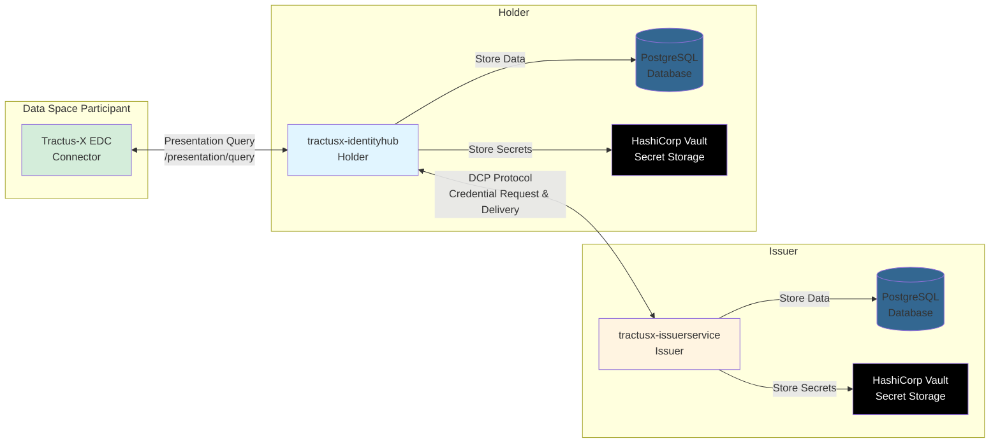

# Tractus-X IdentityHub - a comprehensive DCP Wallet

> [!WARNING]
> This project is under heavy development, expect bugs, problems and radical changes!

Welcome Contributor! Feel free to join our Identity Hub Weeklys if you want to contribute, or our office hours.
You will find the links here: https://eclipse-tractusx.github.io/community/open-meetings/#Identity%20Hub%20Weekly

Also feel free to contact us on our matrix chat: https://matrix.to/#/#tractusx-identity-hub:matrix.eclipse.org

We are working at the moment to bring the current implemented functionalities from the upstream identity hub, test and integrate them here to offer a deployment in Helm Charts and publish our images in docker hub, so you can use also this wallet.

## Table of Contents

1. [About The Project](#about-the-project)
2. [System Architecture](#system-architecture)
3. [Components](#components)
   - [IdentityHub](#identityhub)
   - [IssuerService](#issuerservice)
4. [Getting Started](#getting-started)
   - [IdentityHub](#identityhub-1)
   - [IssuerService](#issuerservice-1)
5. [Deployment](#deployment)
   - [Helm Chart](#helm-chart)
   - [Localhost](#localhost)
6. [Documentation Hub](#documentation-hub)
7. [License](#license)

---

## About The Project

The Tractus-X IdentityHub is a specialized, production-ready distribution of the upstream [Eclipse EDC IdentityHub project](https://github.com/eclipse-edc/IdentityHub/), tailored specifically for the Tractus-X ecosystem.

This project provides deployable versions of two core components:

- **IdentityHub**: A comprehensive DCP (Decentralized Claims Protocol) wallet that manages verifiable credentials and decentralized identities
- **IssuerService**: A service for issuing verifiable credentials to participants in the dataspace

Both components implement the Decentralized Claims Protocol (DCP) specification, ensuring interoperability and standardized credential exchange within the Tractus-X ecosystem. The project offers ready-to-deploy Helm charts with PostgreSQL and HashiCorp Vault integration for production environments, as well as memory-based variants for development and testing.

## System Architecture

The Tractus-X IdentityHub consists of two main components that work together to provide complete credential lifecycle management:

**Key Interactions:**

1. **Credential Issuance (IssuerService ↔ IdentityHub)**:
    - Holder's IdentityHub requests credentials from IssuerService via DCP Issuance Flow
    - IssuerService evaluates attestations and rules
    - Credentials are signed and delivered to holder's IdentityHub for storage

2. **Credential Presentation (Connector ↔ IdentityHub)**:
    - Tractus-X EDC Connector requests credential presentation via `/presentation/query` endpoint
    - IdentityHub creates verifiable presentations from stored credentials
    - Presentations are sent to connector for validation during dataspace interactions

## Components

### IdentityHub

The IdentityHub serves as a comprehensive identity wallet and credential management system. Its primary purposes are:

- **Credential Storage**: Securely store and manage verifiable credentials received from issuers
- **Identity Management**: Manage decentralized identities (DIDs) and their associated key pairs
- **Credential Presentation**: Present credentials to verifiers during DCP flows
- **Self-Issued ID Tokens**: Create and manage self-issued ID Tokens

### IssuerService

The IssuerService is responsible for the issuance of verifiable credentials to dataspace participants. Its primary purposes are:

- **Credential Issuance**: Issue verifiable credentials to participants based on predefined credential definitions
- **Attestation Management**: Define and manage attestation requirements for credential issuance
- **Credential Lifecycle**: Handle the complete lifecycle of issued credentials, including revocation
- **Standards Compliance**: Ensure all issued credentials comply with DCP specifications and dataspace policies

## Getting Started

This project provides Helm charts for deploying both IdentityHub and IssuerService components. Each component is available in two variants:

### IdentityHub

1. [`tractusx-identityhub`](./charts/tractusx-identityhub/README.md): The recommended, production-ready version that uses PostgreSQL as database and HashiCorp Vault as secret storage.
2. [`tractusx-identityhub-memory`](./charts/tractusx-identityhub-memory/README.md): An ephemeral, memory-only version that stores data and secrets in memory. **Please only use this for demo or testing purposes!**

### IssuerService

1. [`tractusx-issuerservice`](./charts/tractusx-issuerservice/README.md): The recommended, production-ready version that uses PostgreSQL as database and HashiCorp Vault as secret storage.
2. [`tractusx-issuerservice-memory`](./charts/tractusx-issuerservice-memory/README.md): An ephemeral, memory-only version that stores data and secrets in memory. **Please only use this for demo or testing purposes!**

## Deployment

### Helm Chart

To deploy using Helm charts, please refer to the documentation for each variant listed in the [Getting Started](#getting-started) section above. Each chart provides detailed configuration options, prerequisites, and deployment instructions.

> [!NOTE]
> This project is still under heavy development. For the most up-to-date deployment experience, it is recommended to follow the [Localhost](#localhost) deployment instructions below.

### Localhost

For detailed deployment instructions in a localhost environment, please refer to the [Installation Guide](./INSTALL.md).

> [!NOTE]
> While running the applications natively as Java processes or directly as Docker images is possible, it is highly recommended to deploy using the official Helm charts with PostgreSQL and HashiCorp Vault. The Helm chart deployment ensures proper configuration, security, and scalability.

## Documentation Hub

For developer resources, as well as best practices for development and testing, can be found [in this file](./docs/README.md).

## License

Distributed under the Apache 2.0 License.
See [LICENSE](https://github.com/eclipse-tractusx/tractusx-edc/blob/main/LICENSE) for more information.

<!-- MARKDOWN LINKS & IMAGES -->
<!-- https://www.markdownguide.org/basic-syntax/#reference-style-links -->

[contributors-shield]: https://img.shields.io/github/contributors/eclipse-tractusx/tractusx-identityhub.svg?style=for-the-badge

[contributors-url]: https://github.com/eclipse-tractusx/tractusx-identityhub/graphs/contributors

[stars-shield]: https://img.shields.io/github/stars/eclipse-tractusx/tractusx-identityhub.svg?style=for-the-badge

[stars-url]: https://github.com/eclipse-tractusx/tractusx-identityhub/stargazers

[license-shield]: https://img.shields.io/github/license/eclipse-tractusx/tractusx-identityhub.svg?style=for-the-badge

[license-url]: https://github.com/eclipse-tractusx/tractusx-identityhub/blob/main/LICENSE

[release-shield]: https://img.shields.io/github/v/release/eclipse-tractusx/tractusx-identityhub.svg?style=for-the-badge

[release-url]: https://github.com/eclipse-tractusx/tractusx-identityhub/releases
