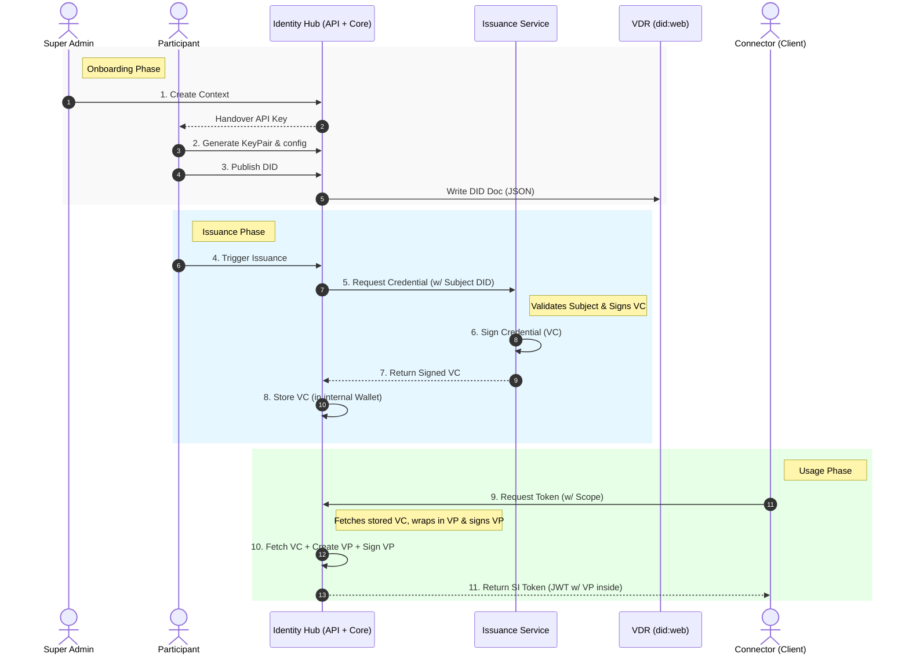

# 4. Runtime View

This document presents the runtime view of the Identity Hub. It describes the concrete behavior and interactions of the system’s building blocks during the complete lifecycle of a participant: from the initial onboarding by a Super Admin to the daily operations of issuing credentials and generating tokens.

## 4.1 Actors

The following actors interact with the Identity Hub through its Management API and DSP interfaces.

| Actor | Description |
| :--- | :--- |
| **Super Admin** | The infrastructure operator. The *only* actor authorized to create the logical isolation boundary (Participant Context) and issue the initial API key. |
| **Participant** | The owner of a specific Context. They manage their own Identity Resources (DIDs, Keys, VCs) using the API key provided by the Super Admin. |
| **Issuer Service** | An external or internal business system that calls the Identity Hub to issue Verifiable Credentials. |
| **Client / Connector** | A software agent that requests identity tokens (SI tokens) to authenticate against other participants. |
| **VDR** | **Verifiable Data Registry**. The external system where DID Documents are published. |

## 4.2 Step by Step Process Flow

The following figure presents the complete process flow at the Identity Hub level, covering the lifecycle from **Onboarding** to **Usage**.

### Phase 1: Onboarding

*Initialization of the participant's identity and cryptographic material.*

* **Step 1: Create Context**
    The **Super Admin** calls the Identity Hub Management API to initialize a new tenant (Context). This creates the logical boundary where the participant's data and keys will reside.

* **Step 2: Generate KeyPair**
    The **Participant** (using the API Key provided after context creation) instructs the Hub to generate the cryptographic keys (Private/Public keys). The private key is securely generated and stored within the Hub's internal vault, never leaving this boundary.

* **Step 3: Publish DID**
    The **Participant** requests the publication of their Decentralized Identifier (DID). The Hub constructs the DID Document, which includes the public verification method and service endpoints.

* **Step 4: Write DID Document**
    The Identity Hub uploads the generated DID Document (JSON) to the **VDR** (Verifiable Data Registry). In a `did:web` implementation, this involves writing the `did.json` file to the `.well-known` path of the corresponding web server.

### Phase 2: Issuance

*Acquisition of Verifiable Credentials (VCs) from an Authority.*

* **Step 5: Trigger Issuance**
    The **Participant** triggers the issuance process via the Hub's API, indicating readiness to receive specific credentials (e.g., membership or certification).

* **Step 6: Request Credential**
    The Identity Hub sends a formal request to the **Issuance Service** (the Authority). This request includes the Participant's DID to identify the subject of the credential.

* **Step 7: Sign Credential (VC)**
    The **Issuance Service** validates the request details. Upon validation, it creates a Verifiable Credential (VC) and cryptographically signs it.

* **Step 8: Return Signed VC**
    The **Issuance Service** transmits the fully signed VC back to the Identity Hub.

* **Step 9: Store VC**
    The Identity Hub receives the signed VC and persists it into its secure internal database (Wallet), making it available for future presentation generation.

### Phase 3: Usage

*Authentication and token generation during runtime.*

* **Step 10: Request Token**
    The **Connector (Client)** detects a need to authenticate with a counterparty. It calls the Identity Hub API requesting a "Self-Issued Token" (SI Token) with a specific Scope (e.g., requesting the inclusion of specific VCs).

* **Step 11: Create & Sign Presentation (VP)**
    The Identity Hub performs the following internal actions:
    1. **Fetch:** Retrieves the relevant Verifiable Credential (VC) from storage.
    2. **Wrap:** Wraps the VC into a Verifiable Presentation (VP) structure.
    3. **Sign:** Signs the VP using the **Participant's Private Key** to prove ownership of the credentials.

* **Step 12: Return SI Token**
    The Identity Hub embeds the signed VP into a **JWT** (JSON Web Token) and returns it to the **Connector**. The Connector can now use this token to authenticate against other participants in the dataspace via the data plane or control plane.

## NOTICE

This work is licensed under the [CC-BY-4.0](https://creativecommons.org/licenses/by/4.0/legalcode).

* SPDX-License-Identifier: CC-BY-4.0
* SPDX-FileCopyrightText: 2026 Contributors to the Eclipse Foundation
* Source URL: <https://github.com/eclipse-tractusx/tractusx-identityhub>
