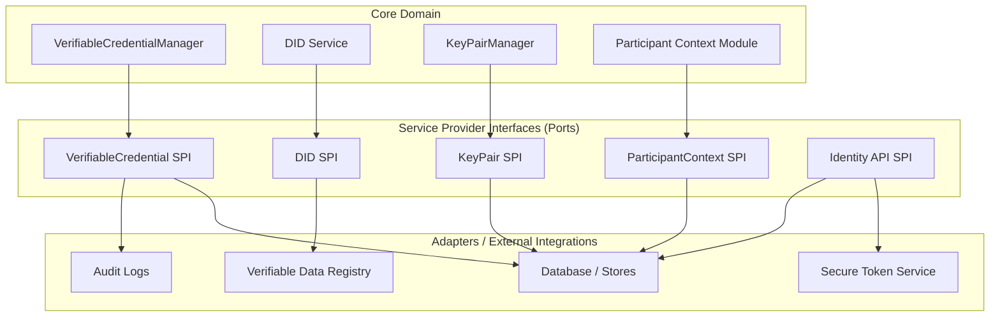
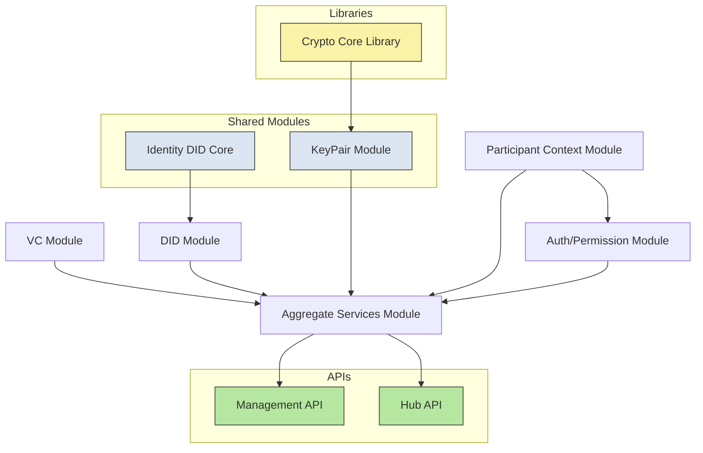
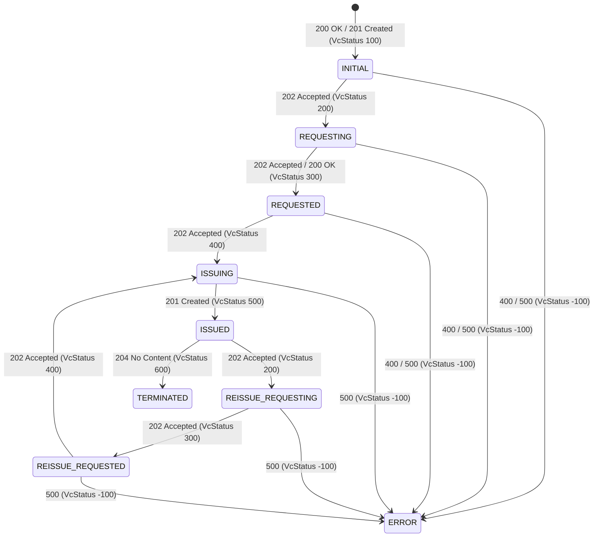
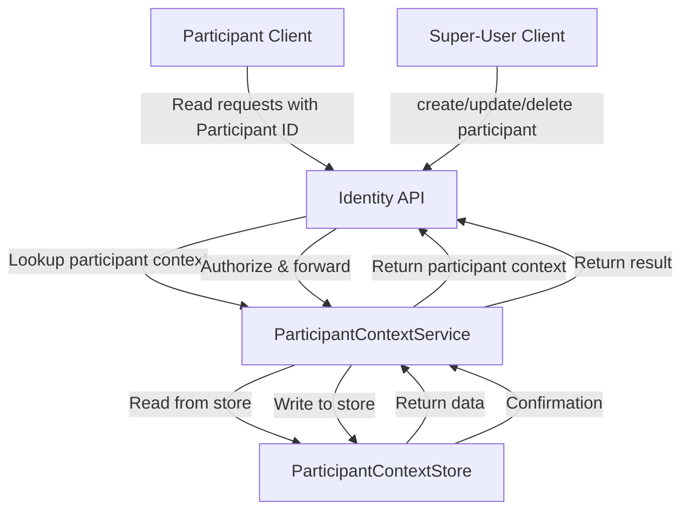
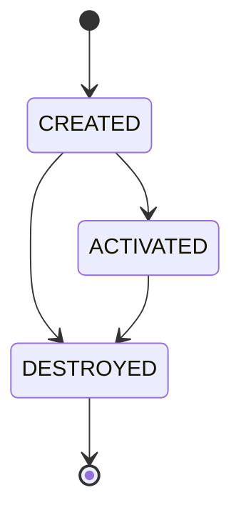
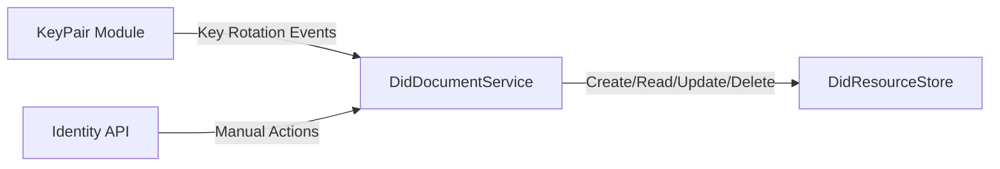
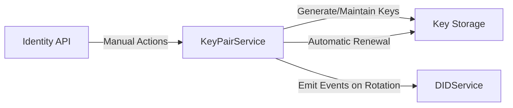
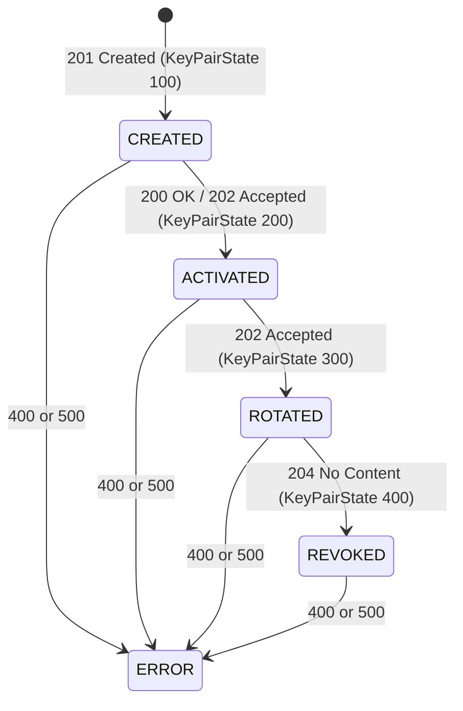
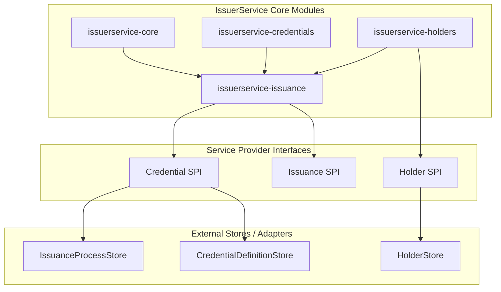

# 5. Building Blocks View

This section describes the building blocks for the two main components:

- Identity Hub (IH)

- IssuerService (IS)

Both components follow a hexagonal architecture (Ports & Adapters), separating core domain logic from external systems, APIs, and infrastructure.

- Core modules contain the business logic (domain).

- Ports define interfaces for interactions with external systems.

- Adapters implement these interfaces, enabling integration with databases, VDRs, STS, or external services.

## Identity Hub Component

### 1. Identity Hub Hexagonal Architecture

The following diagram illustrates how the Core logic is isolated from infrastructure via SPIs.

## Modules and Services

The **Identity Hub** is composed of several modules and services that interact to manage decentralized identities, verifiable credentials, and associated operations. The diagram below illustrates the high-level architecture and relationships between these components.

---

### **Verifiable Credential Module**

**Responsibilities:**

- CRUD operations for Verifiable Credentials (VCs),
- Runs the `VerifiableCredentialManager`.
- Exchanges protocol messages with the Issuer, e.g., in response to a credential-offer.

**VerifiableCredentialManager:**

- Can be configured for **auto-renewal** (default mode is true).
- Once renewal is triggered, the VC moves into the `REISSUE_REQUESTING` state.
- Renewal can be triggered by:
   1. An incoming credential offer.
   2. Nearing expiry (if auto-renewal is active).
   3. Manual action via the Identity API.

**Verifiable Credential Lifecycle:**

---

### Participant Context Module

The Participant Context module manages the storage and lifecycle of participant contexts in the Identity Hub:

- It contains the ParticipantContextStore, which performs CRUD operations on participant entries.

- Mutating operations (create, update, delete) are only allowed by a super-user — typically a technical account used for onboarding or administrative tasks.

- Each participant context is uniquely identified by a **participant ID**.

- Clients must include their **participant ID** with every request to the Hub APIs so that the Identity Hub can locate the correct participant context.

**Participant Context Lifecycle:**

---

### DID Module

**Responsibilities:**

- Create, read, update, and optionally delete DID resources in the `DidResourceStore`.
- Publish/overwrite DID documents using the configured publishers.
- React to **key rotation events** from the KeyPair module (add new keys, remove old keys).
- Respond to manual actions via the Identity API.

---

### KeyPair Module

**Responsibilities:**

- Generate and maintain key pairs using a state machine.
- Check for automatic renewal based on configured maximum key lifetimes.
- Emit events when a key is rotated.
- Respond to manual actions via the Identity API.

**KeyPair Lifecycle:**

---

### Aggregate Services Module

The Aggregate Services Module is responsible for orchestrating complex operations that involve multiple lower-level services within the Identity Hub. Rather than having each client call several services individually, this module provides a single, cohesive interface to perform higher-level tasks.

#### **Key Responsibilities**

1. **Transaction Handling**
    - Ensures that multi-step operations across different services are executed reliably.
    - Supports **atomicity**, so that if one step fails, the module can roll back previous operations to maintain consistency.

2. **Service Orchestration**
    - Coordinates calls to various modules such as the **Participant Service**, **Credential Service**, and **Key Service**.
    - Combines results from these services to return a unified response to the client.

3. **Resource Management**
    - Maintains the state of resources across modules.
    - Handles event publishing to notify other parts of the system about changes in resources or contexts.

4. **Simplified Client Interaction**
    - Clients do not need to understand the internal dependencies between services.
    - Provides a higher-level API that abstracts the complexity of multiple underlying modules.

---

### SPI Module

The SPI Module (Service Provider Interface) provides extension points that allow the Identity Hub to interact with external systems or to swap implementations of internal functionality without modifying the core code. SPIs are abstractions.

---

## IssuerService component

### 1. Overview

The **IssuerService** is a component that is responsible for issuing **Verifiable Credentials (VCs)**.
It handles:

- Validation of issuance requests.
- Application of issuer-defined policies.
- Generation of W3C-compliant credentials.
- Persistence of issuance records.

The IssuerService is composed of several core modules and exposes SPIs for extensibility:

---

### 2. Core Modules of IssuerService

#### Issuerservice-core

- Contains the **core logic** of the IssuerService.
- Responsible for:
  - Orchestrating the issuance workflow.
  - Applying **issuance rules** and policies.
  - Validating claims against credential definitions.
  - Constructing and signing Verifiable Credentials (VCs).

#### Issuerservice-credentials

- Contains **domain models** and structures for credentials.
- Responsible for:
  - Defining credential schemas and data structures.
  - Supporting JSON-LD and W3C-compliant VC representations.
  - Utilities for credential transformation and serialization.

#### Issuerservice-holders

- Handles interactions with **credential holders** (the entity receiving the VC).
- Responsible for:
  - Optional SPI to store or notify holders.
  - Interfacing with `HolderStore` implementations (SQL or other backends).
  - Managing holder-related metadata or attestations.

#### Issuerservice-issuance

- Contains the **implementation of the issuance service**.
- Responsible for:
  - Integrating core logic, credential models, and holder interactions.
  - Recording issuance metadata in the **IssuanceProcessStore**.
  - Exposing SPI or API hooks for external IdentityHub components.
  - Ensuring auditability and traceability of issued credentials.

---

### 3. IssuerService SPIs

The IssuerService exposes several SPIs (Service Provider Interfaces) to allow for extensibility and customization:

#### Issuerservice-credential-spi

Handles credential status management and operations:

- **CredentialStatusService**: Manages credential lifecycle operations like revocation, suspension, and status checking.
- **IssuerCreentialOfferService**: Sends credential offers to holders proactively.

#### Issuerservice-issuance-spi

Manages the credential issuance process lifecycle:

- **AttestationSource**: Sources data when an attestation pipeline is executed for credential issuance requests
- **AttestationContext**: Provides access to context data for attestation evaluation, including validated token claims and participant ID
- **CredentialGenerator**: Generates and signs credentials based on definitions and claims
- **CredentialGeneratorRegistry**: Registry for credential generators based on CredentialFormat
- **IssuanceProcess**: Tracks credential issuance processes through states ( SUBMITTED, APPROVED, DELIVERED,ERRORED).

#### Issuerservice-holder-spi

Manages holder-related operations:

- **HolderService**: Manages holder information and operations within the issuer service context.

### Key Notes

1. IssuerService only persists metadata, not the full VC. Full VC storage happens in IdentityHub.

2. CredentialDefinitionStore provides schema, policies, and issuer DID.

3. IssuanceProcessStore logs issuance for auditing and potential revocation.

4. Issuerservice-issuance-rules module enforces policy/validation logic.

5. HolderStore can be SQL-backed or another SPI implementation for storing VCs.

---

## NOTICE

This work is licensed under the [CC-BY-4.0](https://creativecommons.org/licenses/by/4.0/legalcode).

- SPDX-License-Identifier: CC-BY-4.0
- SPDX-FileCopyrightText: 2026 Contributors to the Eclipse Foundation
- Source URL: <https://github.com/eclipse-tractusx/tractusx-identityhub>
