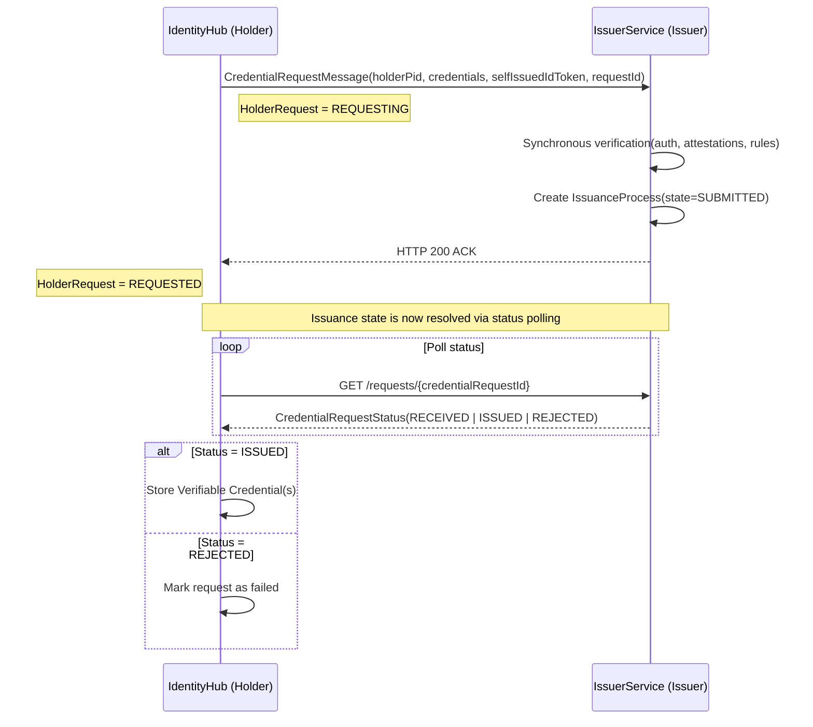
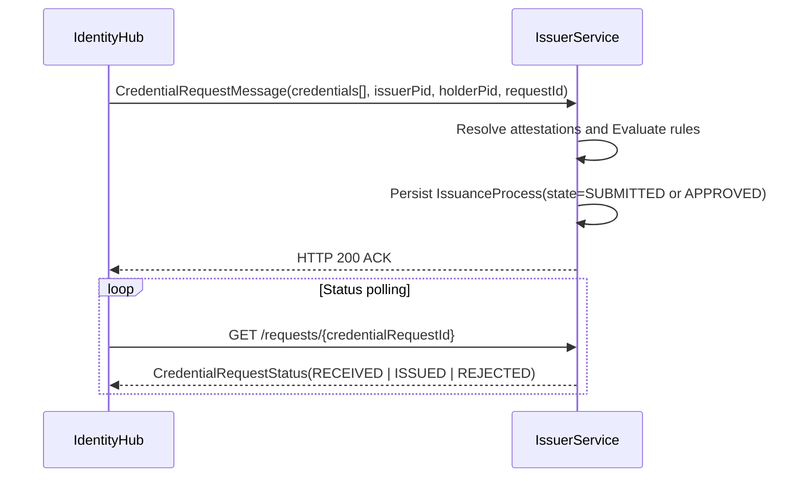
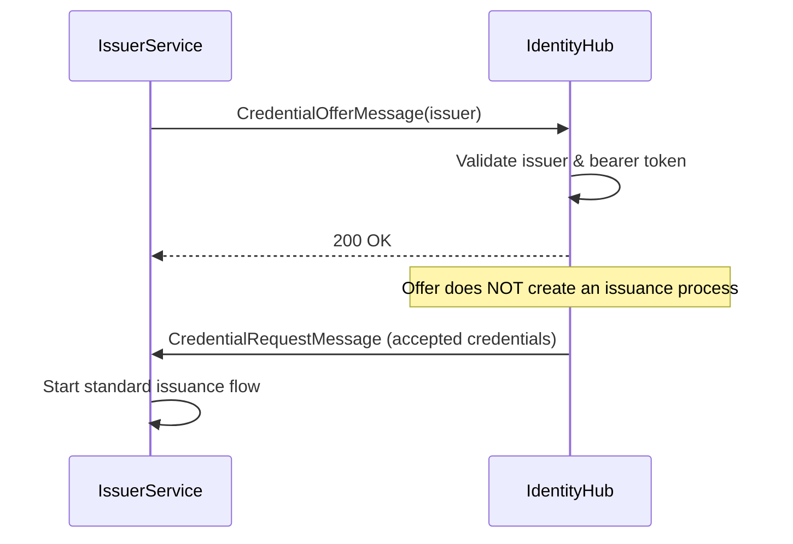
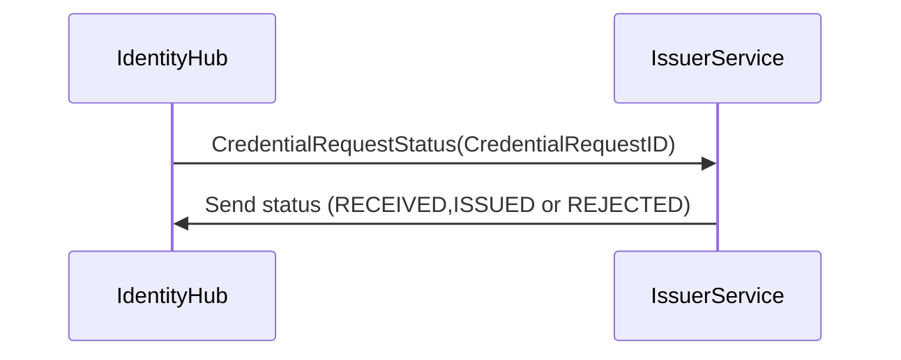

# General view of Identity Hub and the IssuerService component

This represents a high-level architecture overview of the `IdentityHub` service and the `IssuerService` component.

## Key Interaction Flows

### 1. Credential Request Flow (IdentityHub → Issuer)

The IdentityHub initiates credential requests by sending a `CredentialRequestMessage` to the Issuer Service. This includes:

### 2. Credential Offer Flow (Issuer → IdentityHub) (not implemented as of 2025-12-17 )

The Issuer can proactively offer credentials to holders through the `IssuerCredentialOfferService`:

### 4. Status Management Flow (IdentityHub → Issuer)

The IdentityHub can check credential status, and the Issuer provides status information.

- **Credential Request ID**: For identifying the specific credential.
- **Status Information**: For status checking.

---

## Technical Implementation

The interaction is implemented through several key components:

- **CredentialRequestManager**: Manages the credential request lifecycle on the holder side.
- **IssuerCredentialOfferService**: Handles sending credential offers from issuer to holder.
- **Authentication**: Uses self-issued ID tokens and bearer tokens for security.

---

## Notes

- The IdentityHub and Issuer Service can be deployed as separate services or collocated in the same runtime.
- All interactions are authenticated and authorized using DIDs and tokens.
- The system supports both pull-based (holder requests) and push-based (issuer offers) credential distribution.
- Credential status is managed through status list credentials for efficient revocation checking.
- Issuance and re-issuance, both act the same.

## NOTICE

This work is licensed under the [CC-BY-4.0](https://creativecommons.org/licenses/by/4.0/legalcode).

- SPDX-License-Identifier: CC-BY-4.0
- SPDX-FileCopyrightText: 2026 Contributors to the Eclipse Foundation
- Source URL: <https://github.com/eclipse-tractusx/tractusx-identityhub>
