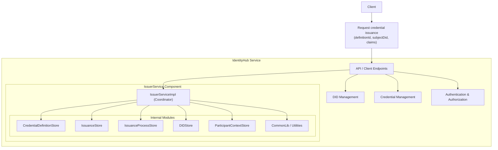
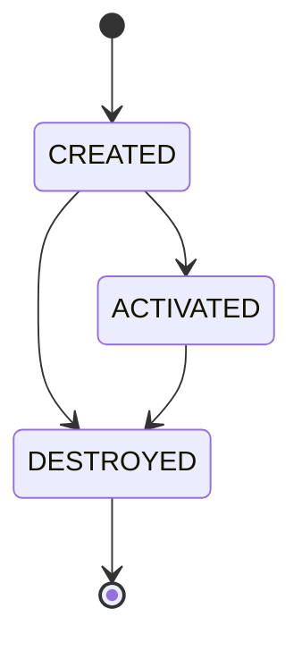
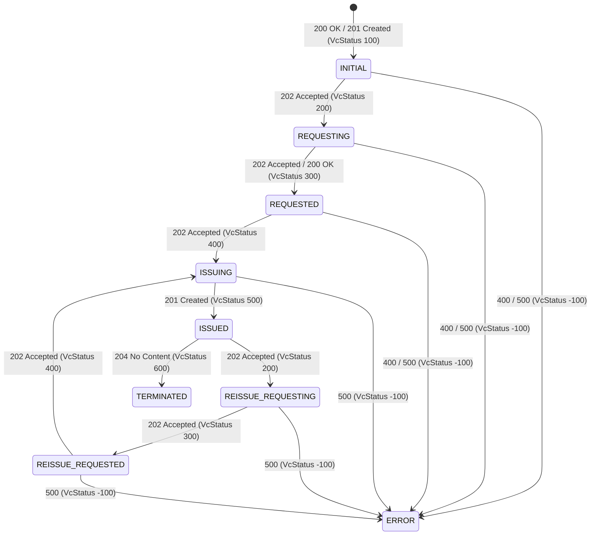
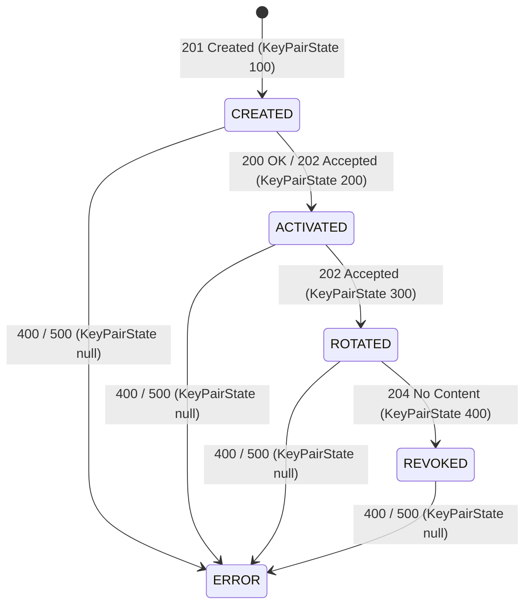

# General view of Identity Hub and the IssuerService component

This represents a high-level architecture overview of the `IdentityHub` service, focusing on the `IssuerService` component and its internal modules.



##  Identity Hub in Tractus-X

The `Identity Hub`  (IH) is the component responsible for managing an organization’s decentralized identity within the Tractus-X dataspace.
`Identity Hub` (IH) manages identity resources in a dataspace. Specifically, it provides two services:

- **Credential Service (CS)**. The CS manages [Verifiable Credentials](https://www.w3.org/TR/vc-data-model/).
  This includes read and write endpoints for Verifiable Presentations (VPs) and Verifiable Credentials (VCs).
- **DID Service (DIDS)**. The DIDS is responsible for the creation, management and resolution of participant DIDs.

### Key Responsibilities
- **Verifiable Credentials**
    - Receives and manages issued credentials (e.g., *MembershipCredential*, *BussinessPartnerCredential*, *AuditCertificationCredential*...).
    - Generates **Verifiable Presentations (VPs)** for proof requests.
-  **Key Pairs**
    - Generates, rotates, and revokes signing keys.
    - Publishes public key material in the participant’s DID Document.
- **DID Documents**
    - Generates and publishes DID documents using the **did:web** method.
    - Enables verifiable linkage between public keys and participant identifiers.

Identity Hub supports **machine-to-machine trust**, not end-user authentication — therefore, **OID4VC is not used**. Instead, the IH implements **DCP**, which is optimized for automated trust exchange between connectors.

> [NOTE] If your're new in this topic, please refer to the  [DCP](https://eclipse-dataspace-dcp.github.io/decentralized-claims-protocol/v1.0-RC4/) protocol.
## 1. Deployment Topologies

One deployment topologies is supported:

**Standalone**: The Identity Hub is deployed as a single or clustered standalone runtime

### 1.1 Use Cases
The Identity Hub supports the following use cases:
1. Initiate and manage credential requests
2. Serve Verifiable Presentations (VPs)
3. Monitor and manage credential re-issuance
4. Manage DIDs, DID documents, and publication to a VDR (Verifiable Data Registry)

---

## 2. Architecture Overview
### 2.1 Participant Context
A Participant Context (PC) is a logical container for identity resources associated with a dataspace participant.Is tied  to the participant identity as defined in the [DSP specification](**https://eclipse-dataspace-protocol.github.io/dsp/v1.1/spec**).

- All resources (VCs, DIDs, keys) are tied to a context

- Access control for API endpoints is scoped to the PC

- Removing a PC cascades to all contained resources

- Services can subscribe to participant context events: CREATED, ACTIVATED, DESTROYED

### 2.2 Identity Resources

An **identity resource** represents any data associated with a dataspace participant. This can include:

- **Attestations**
- **Cryptographic key material**
- **Unique identifiers**

Examples of identity resources are:

- **Verifiable Credentials (VCs)**
- **Decentralized Identifiers (DIDs)**
- **DID Documents**

#### 2.2.1 Verifiable Credential Resource
A `Verifiable Credential Resource` is a type of identity resource and is stored on the holder side.

The lifecycle of a Verifiable Credential Resource is as follows:


Three areas to `Verifiable Credential Resource` will be used:

1. On the holder side, the older manages credentials and uses them in verifiable presentations.
2. On the issuer side, to track issued credentials. The issuer must keep track of which credentials were issued to which holder. In this case, the signed credential **must not be stored** by the issuer.
3. On the issuer side, to manage revocation credentials. Issuers must resolve a revocation list credential. In this case, metadata about the credential, in particular the credentialSubject (containing the bit string) **must not be stored** by the issuer.

#### 2.2.1.1 The VerifiableCredentialManager
The **VerifiableCredentialManager** (VCM) manages `Verifiable Credential Resource` across participant contexts. For example, it monitors outstanding requests and initiates reissue flows. The VCM is cluster-aware and guarantees that only one flow is in effect for a particular VCR across all runtime instances.

Services may register to receive VerifiableCredentialManager events, for example, when a flow is initiated.
### 2.2.2 KeyPair Resources
A `KeyPair Resource` is a type of `Identity Resource` that represents a cryptographic key pair (public-private) used for signing and verification operations. Key pairs are associated with a participant context and are managed by the DID Service.

#### 2.2.2.1 The KeyPairManager

The **KeyPairManager** (KPM) manages `KeyPair Resources` across participant contexts. It handles key generation, rotation, and revocation operations. The KPM is cluster-aware and ensures that key lifecycle operations are consistent across all runtime instances.


Services may register to receive KeyPairManager events, for example, when a rotation or revocation is initiated.

#### 2.2.3 DID Resources
A `DID Resource` is a type of `Identity Resource` that represents a Decentralized Identifier (DID) associated with a participant context. The DID Service manages the lifecycle of DIDs, including creation, publication, and resolution.

An example of a Did Resource is a `did:web` identifier.

```json
{
  "did": "did:web:eclipse-tractus-x",
  "state": "PUBLISHED",
  "stateTimestamp": 1729774800000,
  "createTimestamp": 1729700000000,
  "document": {
    "@context": "https://www.w3.org/ns/did/v1",
    "id": "did:web:eclipse-tractus-x",
    "verificationMethod": [
      {
        "id": "did:web:eclipse-tractus-x#key-1",
        "type": "Ed25519VerificationKey2020",
        "controller": "did:web:eclipse-tractus-x",
        "publicKeyMultibase": "z6MkoC2pL8aN4vNnhM1Vv7R7WZtR6PYwA2WqTzc8hRbLkhrD"
      }
    ],
    "authentication": [
      "did:web:eclipse-tractus-x#key-1"
    ],
    "assertionMethod": [
      "did:web:eclipse-tractus-x#key-1"
    ]
  }
}
```
The did document is defined according to the [DID Core Specification](https://www.w3.org/TR/did-core/).

#### 2.2.4 DID Publisher
The `DidPublisher` is responsible for taking a `DidResource`, generating a W3C-compliant DID Document, and publishing it to a Verifiable Data Registry (VDR). The `DidPublisher` is also responsible for un-publishing DID Documents, for example, when a participant context is removed.

### 2.3 Verifiable Presentation Generation
When a VP is requested, a VerifiablePresentation is created from a VC by the VerifiablePresentationGenerator. The generator is responsible for assembling the VP (potentially from multiple VCs) and creating a proof.

### 2.4 Secure Token Service (STS)
The Security Token Service is and IdentityService implementation responsible for creating self-issued tokens per the Base Identity Protocol.
When creating a self-issued token, STS will support the creation of a VP Access Token using the scope scheme specified in the [DCP](https://eclipse-dataspace-dcp.github.io/decentralized-claims-protocol/v1.0-RC4/). Access tokens are always scoped to a **participant context**.

### 2.5 Identity APIs
The **Identity API** is an internal management interface of the **Identity Hub**.  
It allows **authorized clients** (for example, administrative tools or internal services) to send requests that perform **operational or management actions**.


###  Operation Categories

These operations can be divided into two main categories:


#### 1. Global (installation-wide) operations

These require **elevated privileges** (often an admin API key or service account, in this case super-user).  
They affect the **entire Identity Hub deployment** rather than a single user or participant.

**Examples:**
- Registering or deleting participants.
- Rotating global cryptographic keys.
- Configuring system-level settings (e.g., endpoints, policies).
- Managing database migrations or clearing caches.


#### 2. Participant-scoped operations

These are limited to a **specific participant or tenant context** inside the hub.  
They only affect the data or credentials associated with that participant.

**Examples:**
- Issuing or revoking credentials for that participant.
- Managing that participant’s DID documents.
- Updating access policies or credentials within their scope.
---


## NOTICE
This work is licensed under the [CC-BY-4.0](https://creativecommons.org/licenses/by/4.0/legalcode).

- SPDX-License-Identifier: CC-BY-4.0
- SPDX-FileCopyrightText: 2024 Contributors to the Eclipse Foundation
- Source URL: <https://github.com/eclipse-tractusx/tractusx-identityhub>
---