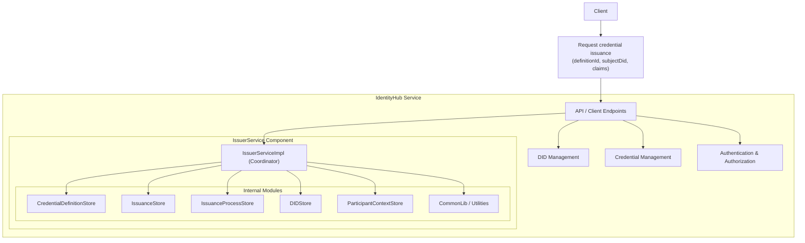

# General view of Identity Hub and the IssuerService component

This represents a high-level architecture overview of the `IdentityHub` service, focusing on the `IssuerService` component and its internal modules.

## Key Interaction Flows

## 1. Credential Request Flow (IdentityHub → Issuer)

The IdentityHub initiates credential requests by sending a `CredentialRequestMessage` to the Issuer Service. This includes:

- **Holder DID**: For identifying the requesting participant.
- **Credential Types and Formats**: What credentials are requested and in what format.
- **Self-Issued ID Token**: For authentication per DCP specification.
- **Holder Process ID**: For tracking the request on the holder side.

The request is tracked in a `HolderCredentialRequest` object that transitions through states:  
**CREATED → REQUESTING → REQUESTED → ISSUED** .

## 2. Credential Issuance Flow (Issuer → IdentityHub)

The Issuer Service processes requests and issues credentials back to the IdentityHub.

- **Verifiable Credentials**: The signed credentials containing the claims.
- **Issuer Process ID**: For tracking on the issuer side.
- **Credential Metadata**: Including issuance policies and reissuance policies.
- **Status Information**: For credential revocation checking.

## 3. Credential Offer Flow (Issuer → IdentityHub)

The Issuer can proactively offer credentials to holders through the `IssuerCredentialOfferService`:.

- **Credential Descriptors**: Describing the offered credentials.
- **Holder DID**: Target recipient identifier.
- **Authentication Token**: Bearer token for secure delivery.
- **Offer Message**: DCP-compliant credential offer message.

## 4. Status Management Flow (IdentityHub → Issuer)

The IdentityHub can check credential status, and the Issuer provides status information.

- **Credential ID**: For identifying the specific credential.
- **Status List Information**: For revocation status checking.
- **Revocation/Suspend Operations**: For credential lifecycle management.

---

## Technical Implementation

The interaction is implemented through several key components:

- **CredentialRequestManager**: Manages the credential request lifecycle on the holder side.
- **IssuerCredentialOfferService**: Handles sending credential offers from issuer to holder.
- **DCP Protocol**: Provides the messaging format and transport.
- **Authentication**: Uses self-issued ID tokens and bearer tokens for security.

---

## Notes

- The IdentityHub and Issuer Service can be deployed as separate services or collocated in the same runtime.
- All interactions are authenticated and authorized using DIDs and tokens.
- The system supports both pull-based (holder requests) and push-based (issuer offers) credential distribution.
- Credential status is managed through status list credentials for efficient revocation checking.

## NOTICE

This work is licensed under the [CC-BY-4.0](https://creativecommons.org/licenses/by/4.0/legalcode).

- SPDX-License-Identifier: CC-BY-4.0
- SPDX-FileCopyrightText: 2025 Contributors to the Eclipse Foundation
- Source URL: <https://github.com/eclipse-tractusx/tractusx-identityhub>
