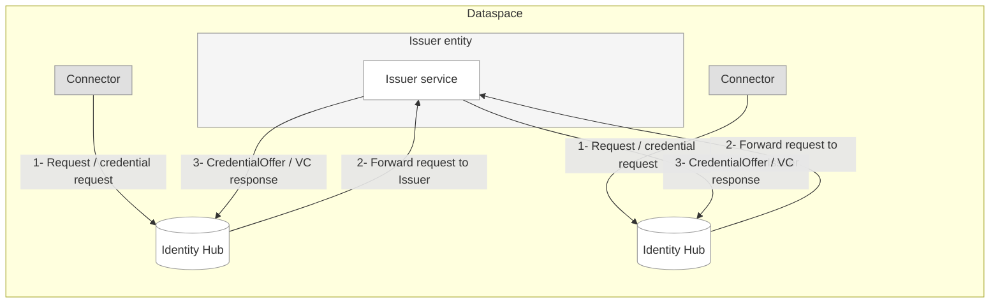

##  Identity Hub in Tractus-X

The `Identity Hub`  (IH) is the component responsible for managing an organization’s decentralized identity within the Tractus-X dataspace.
`Identity Hub` (IH) manages identity resources in a dataspace. Specifically, it provides two services:

- **Credential Service (CS)**. The CS manages [Verifiable Credentials](https://www.w3.org/TR/vc-data-model/).
  This includes read and write endpoints for Verifiable Presentations (VPs) and Verifiable Credentials (VCs).
- **DID Service (DIDS)**. The DIDS is responsible for the creation, management and resolution of participant DIDs.

### Key Responsibilities
- **Verifiable Credentials**
    - Receives and manages issued credentials (e.g., *MembershipCredential*, *BussinessPartnerCredential*, *AuditCertificationCredential*...).
    - Generates **Verifiable Presentations (VPs)** for proof requests.
-  **Key Pairs**
    - Generates, rotates, and revokes signing keys.
    - Publishes public key material in the participant’s DID Document.
- **DID Documents**
    - Generates and publishes DID documents using the **did:web** method.
    - Enables verifiable linkage between public keys and participant identifiers.

Identity Hub supports **machine-to-machine trust**, not end-user authentication — therefore, **OID4VC is not used**. Instead, the IH implements **DCP**, which is optimized for automated trust exchange between connectors.

> [!NOTE] If your're new in this topic, please refer to the  [DCP](https://eclipse-dataspace-dcp.github.io/decentralized-claims-protocol/v1.0-RC4/) protocol.
## Deployment Topologies

One deployment topologies is supported:

1. **Standalone**: The Identity Hub is deployed as a single or clustered standalone runtime

## How it Works

The diagram above illustrates the interaction between Connectors, Identity Hubs, and an Issuer Service during a credential issuance process.
## NOTICE

This work is licensed under the [CC-BY-4.0](https://creativecommons.org/licenses/by/4.0/legalcode).

- SPDX-License-Identifier: CC-BY-4.0
- SPDX-FileCopyrightText: 2024 Contributors to the Eclipse Foundation
- Source URL: <https://github.com/eclipse-tractusx/tractus-x-identityhub>
---