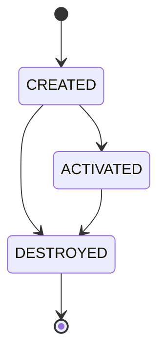
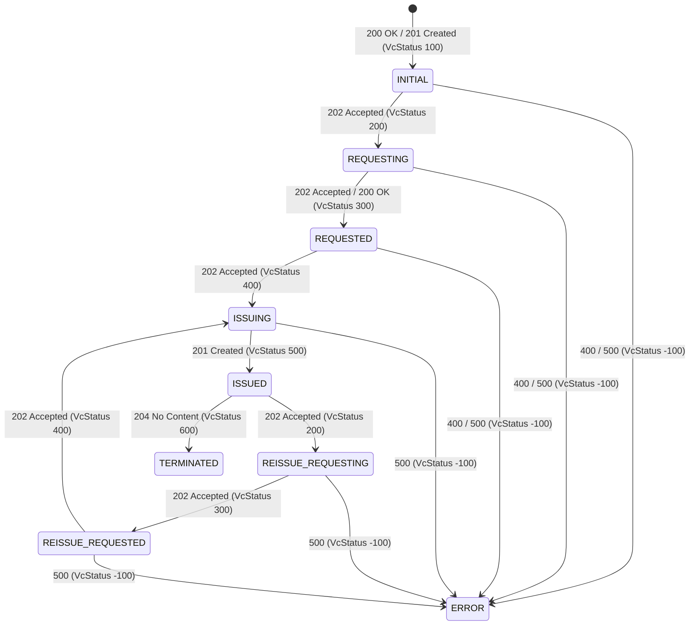
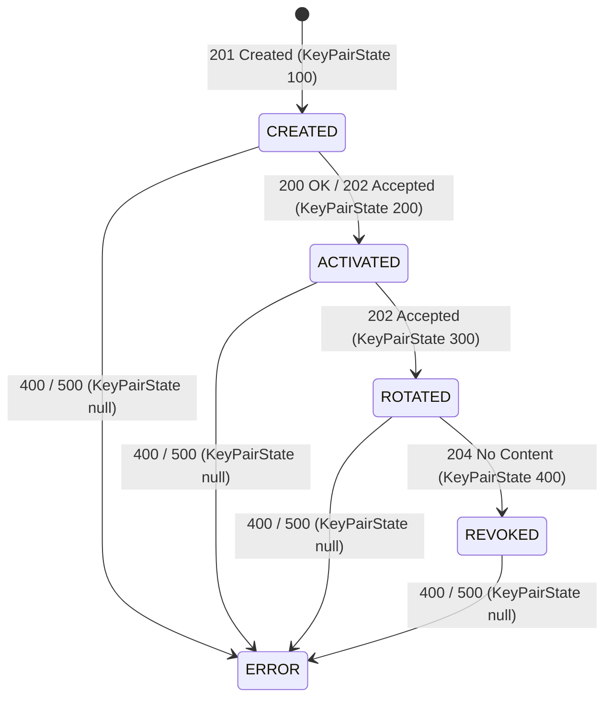
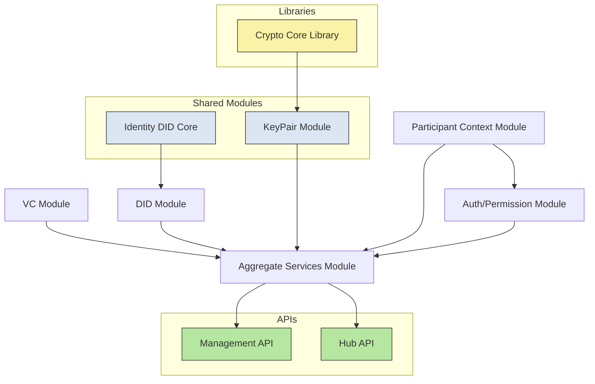
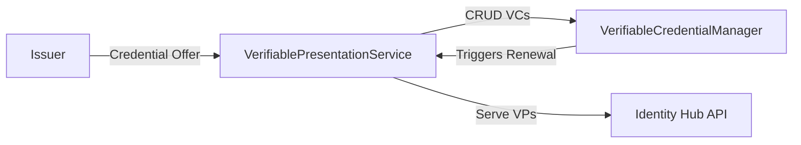
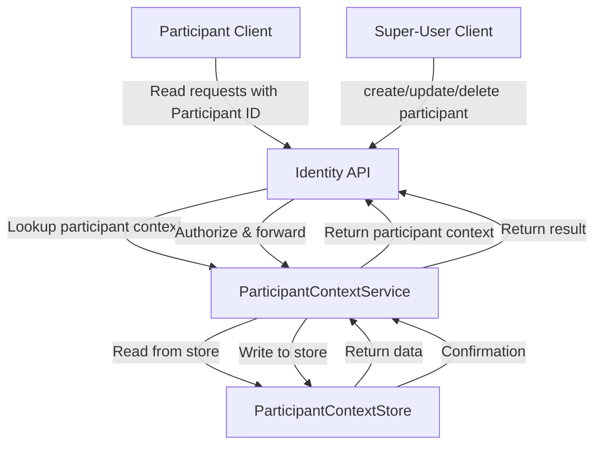
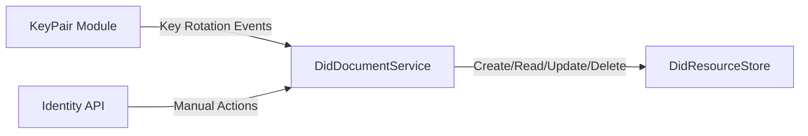
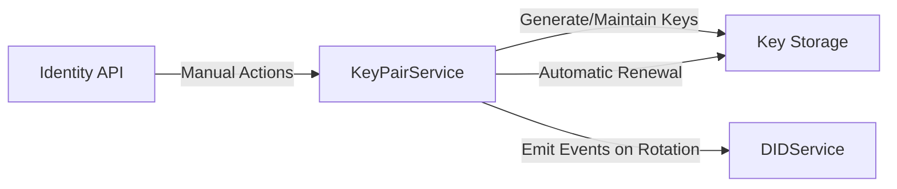
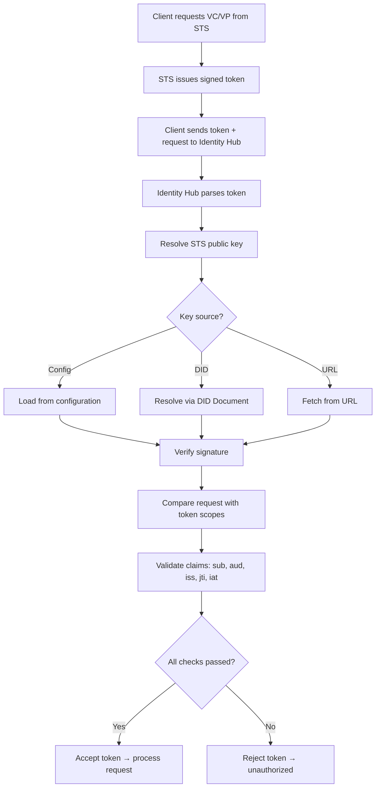

# General view of Identity Hub

The `Identity Hub`  (IH) is the component responsible for managing an organization’s decentralized identity within the Tractus-X dataspace.
`Identity Hub` (IH) manages identity resources in a dataspace. Specifically, it provides two services:

- **Credential Service (CS)**. The CS manages [Verifiable Credentials](https://www.w3.org/TR/vc-data-model/).
  This includes read and write endpoints for Verifiable Presentations (VPs) and Verifiable Credentials (VCs).
- **DID Service (DIDS)**. The DIDS is responsible for the creation, management and resolution of participant DIDs.

## Key Responsibilities

- **Verifiable Credentials**
  - Receives and manages issued credentials (e.g., *MembershipCredential*, *BussinessPartnerCredential*, *AuditCertificationCredential*...).
  - Generates **Verifiable Presentations (VPs)** for proof requests.
- **Key Pairs**
  - Generates, rotates, and revokes signing keys.
  - Publishes public key material in the participant’s DID Document.
- **DID Documents**
  - Generates and publishes DID documents using the **did:web** method.
  - Enables verifiable linkage between public keys and participant identifiers.

Identity Hub supports **machine-to-machine trust**, not end-user authentication — therefore, **OID4VC is not used**. Instead, the IH implements **DCP**, which is optimized for automated trust exchange between connectors.

> [NOTE] If your're new in this topic, please refer to the  [DCP](https://eclipse-dataspace-dcp.github.io/decentralized-claims-protocol/v1.0-RC4/) protocol.
>
## 1. Deployment Topologies

One deployment topologies is supported:

**Standalone**: The Identity Hub is deployed as a single or clustered standalone runtime

### 1.1 Use Cases

The Identity Hub supports the following use cases:

1. Initiate and manage credential requests
2. Serve Verifiable Presentations (VPs)
3. Monitor and manage credential re-issuance
4. Manage DIDs, DID documents, and publication to a VDR (Verifiable Data Registry)

---

## 2. Architecture Overview

### 2.1 Participant Context

A Participant Context (PC) is a logical container for identity resources associated with a dataspace participant.Is tied  to the participant identity as defined in the [DSP specification](**https://eclipse-dataspace-protocol.github.io/dsp/v1.1/spec**).

- All resources (VCs, DIDs, keys) are tied to a context

- Access control for API endpoints is scoped to the PC

- Removing a PC cascades to all contained resources

- Services can subscribe to participant context events: CREATED, ACTIVATED, DESTROYED



### 2.2 Identity Resources

An **identity resource** represents any data associated with a dataspace participant. This can include:

- **Attestations**
- **Cryptographic key material**
- **Unique identifiers**

Examples of identity resources are:

- **Verifiable Credentials (VCs)**
- **Decentralized Identifiers (DIDs)**
- **DID Documents**

#### 2.2.1 Verifiable Credential Resource

A `Verifiable Credential Resource` is a type of identity resource and is stored on the holder side.

The lifecycle of a Verifiable Credential Resource is as follows:



Three areas to `Verifiable Credential Resource` will be used:

1. On the holder side, the older manages credentials and uses them in verifiable presentations.
2. On the issuer side, to track issued credentials. The issuer must keep track of which credentials were issued to which holder. In this case, the signed credential **must not be stored** by the issuer.
3. On the issuer side, to manage revocation credentials. Issuers must resolve a revocation list credential. In this case, metadata about the credential, in particular the credentialSubject (containing the bit string) **must not be stored** by the issuer.

#### 2.2.1.1 The VerifiableCredentialManager

The **VerifiableCredentialManager** (VCM) manages `Verifiable Credential Resource` across participant contexts. For example, it monitors outstanding requests and initiates reissue flows. The VCM is cluster-aware and guarantees that only one flow is in effect for a particular VCR across all runtime instances.

Services may register to receive VerifiableCredentialManager events, for example, when a flow is initiated.

### 2.2.2 KeyPair Resources

A `KeyPair Resource` is a type of `Identity Resource` that represents a cryptographic key pair (public-private) used for signing and verification operations. Key pairs are associated with a participant context and are managed by the DID Service.



#### 2.2.2.1 The KeyPairManager

The **KeyPairManager** (KPM) manages `KeyPair Resources` across participant contexts. It handles key generation, rotation, and revocation operations. The KPM is cluster-aware and ensures that key lifecycle operations are consistent across all runtime instances.

Services may register to receive KeyPairManager events, for example, when a rotation or revocation is initiated.

#### 2.2.3 DID Resources

A `DID Resource` is a type of `Identity Resource` that represents a Decentralized Identifier (DID) associated with a participant context. The DID Service manages the lifecycle of DIDs, including creation, publication, and resolution.

An example of a Did Resource is a `did:web` identifier.

```json
{
  "did": "did:web:eclipse-tractus-x",
  "state": "PUBLISHED",
  "stateTimestamp": 1729774800000,
  "createTimestamp": 1729700000000,
  "document": {
    "@context": "https://www.w3.org/ns/did/v1",
    "id": "did:web:eclipse-tractus-x",
    "verificationMethod": [
      {
        "id": "did:web:eclipse-tractus-x#key-1",
        "type": "Ed25519VerificationKey2020",
        "controller": "did:web:eclipse-tractus-x",
        "publicKeyMultibase": "z6MkoC2pL8aN4vNnhM1Vv7R7WZtR6PYwA2WqTzc8hRbLkhrD"
      }
    ],
    "authentication": [
      "did:web:eclipse-tractus-x#key-1"
    ],
    "assertionMethod": [
      "did:web:eclipse-tractus-x#key-1"
    ]
  }
}
```

The did document is defined according to the [DID Core Specification](https://www.w3.org/TR/did-core/).

#### 2.2.4 DID Publisher

The `DidPublisher` is responsible for taking a `DidResource`, generating a W3C-compliant DID Document, and publishing it to a Verifiable Data Registry (VDR). The `DidPublisher` is also responsible for un-publishing DID Documents, for example, when a participant context is removed.

### 2.3 Verifiable Presentation Generation

When a VP is requested, a VerifiablePresentation is created from a VC by the VerifiablePresentationGenerator. The generator is responsible for assembling the VP (potentially from multiple VCs) and creating a proof.

### 2.4 Secure Token Service (STS)

The Security Token Service is and IdentityService implementation responsible for creating self-issued tokens per the Base Identity Protocol.
When creating a self-issued token, STS will support the creation of a VP Access Token using the scope scheme specified in the [DCP](https://eclipse-dataspace-dcp.github.io/decentralized-claims-protocol/v1.0-RC4/). Access tokens are always scoped to a **participant context**.

### 2.5 Identity APIs

The **Identity API** is an internal management interface of the **Identity Hub**.  
It allows **authorized clients** (for example, administrative tools or internal services) to send requests that perform **operational or management actions**.

### Operation Categories

These operations can be divided into two main categories:

#### 1. Global (installation-wide) operations

These require **elevated privileges** (often an admin API key or service account, in this case super-user).  
They affect the **entire Identity Hub deployment** rather than a single user or participant.

**Examples:**

- Registering or deleting participants.
- Rotating global cryptographic keys.
- Configuring system-level settings (e.g., endpoints, policies).
- Managing database migrations or clearing caches.

#### 2. Participant-scoped operations

These are limited to a **specific participant or tenant context** inside the hub.  
They only affect the data or credentials associated with that participant.

**Examples:**

- Issuing or revoking credentials for that participant.
- Managing that participant’s DID documents.
- Updating access policies or credentials within their scope.
  
---

## Internal Services

- **Credential Service (CS)**: API to issue, store and present VCs/VPs. Ensures W3C VC formats and compatibility with DCP.
- **DID Service (DIDS)**: Management of key pairs, publication of DID Documents (e.g. `did:web`), key rotation and revocation.
- **Identity Service (IS)**: CRUD for organizational identities, mapping to DIDs, trust metadata.
- **Security Token Service (STS)**: Issues short-lived tokens for access to internal APIs (does not replace OIDC; oriented to M2M).

## Main Flows

1. **Credential Issuance**:
    - An external Issuer Service requests VC issuance from the Credential Service, authenticating via STS token.
    - The Credential Service validates the request, generates the VC, and stores it.
2. **Credential Presentation(not implemented yet)**:
    - A Connector requests a Verifiable Presentation (VP) from the Credential Service to prove certain attributes.
    - The Credential Service retrieves the relevant VCs, constructs the VP, and returns it.
3. **DID Management**:
    - The DID Service generates key pairs, creates and publishes DID Documents using `did:web`.
    - It handles key rotation and revocation as needed.
4. **Token Issuance**:
    - The STS issues short-lived access tokens to authenticated clients for accessing IH services.
    - Tokens are validated on each request to ensure secure access.

## Key Features

- W3C Verifiable Credentials and Presentations support.
- DCP protocol compliance for automated trust exchange.
- DID Document management with `did:web`.
- Secure token issuance for M2M authentication.
- Integration points for Issuer Services and external verifiers.
- Key lifecycle management (generation, rotation, revocation).
- Audit logging for credential operations.
  
---

## Modules and Services

The **Identity Hub** is composed of several modules and services that interact to manage decentralized identities, verifiable credentials, and associated operations. The diagram below illustrates the high-level architecture and relationships between these components.



---

### **Verifiable Credential Module**



**Responsibilities:**

- Generates and serves Verifiable Presentations (VPs) through the Hub API.
- CRUD operations for Verifiable Credentials (VCs), e.g., when the Issuer wants to write a VC via the Hub API or the Identity API.
- Runs the `VerifiableCredentialManager`.
- Exchanges protocol messages with the Issuer, e.g., in response to a credential-offer.

**VerifiableCredentialManager:**

- Can be configured for **auto-renewal** (default: true).
- Once renewal is triggered, the VC moves into the `REISSUE_REQUESTING` state.
- Renewal can be triggered by:
   1. An incoming credential offer.
   2. Nearing expiry (if auto-renewal is active).
   3. Manual action via the Identity API.

---

### Participant Context Module

The Participant Context module manages the storage and lifecycle of participant contexts in the Identity Hub:

- It contains the ParticipantContextStore, which performs CRUD operations on participant entries.

- Mutating operations (create, update, delete) are only allowed by a super-user — typically a technical account used for onboarding or administrative tasks.

- Each participant context is uniquely identified by a **participant ID**.

- Clients must include their **participant ID** with every request to the Hub APIs so that the Identity Hub can locate the correct participant context.
  


---

### DID Module



**Responsibilities:**

- Create, read, update, and optionally delete DID resources in the `DidResourceStore`.
- Publish/overwrite DID documents using the configured publishers.
- React to **key rotation events** from the KeyPair module (add new keys, remove old keys).
- Respond to manual actions via the Identity API.

---

### KeyPair Module



**Responsibilities:**

- Generate and maintain key pairs using a state machine.
- Check for automatic renewal based on configured maximum key lifetimes.
- Emit events when a key is rotated.
- Respond to manual actions via the Identity API.

---

### Auth/Permissions Module

When the Identity Hub (IH) receives a request containing a token issued by the Security Token Service (STS), it must parse and validate that token before processing the request.

Steps:

1. Parse the token

    - Extract the token from the request (e.g., a JWT).
    - Decode its structure to access the header, payload, and signature.

2. Verify the signature

    - Use the STS’s public key to verify that the token was signed by the STS’s private key.

    - The IH must be able to obtain the STS’s public key through one of several possible mechanisms:
       - A static configuration value
       - Resolution through a DID document
       - Retrieval from a URL endpoint

    - This logic should be abstracted using a resolver component (e.g., PublicKeyResolver).

3. Validate the request against scopes

    - Compare the requested operation or resource with the scopes included in the token to ensure authorization.

4. Validate additional claims

    - Check standard JWT claims depending on the proof-of-possession model (sub, aud, iss, jti, iat...)

If all checks pass, the token is accepted and the request proceeds; otherwise, it’s rejected.



---

### Aggregate Services Module

The Aggregate Services Module is responsible for orchestrating complex operations that involve multiple lower-level services within the Identity Hub. Rather than having each client call several services individually, this module provides a single, cohesive interface to perform higher-level tasks.

#### **Key Responsibilities**

1. **Transaction Handling**
    - Ensures that multi-step operations across different services are executed reliably.
    - Supports **atomicity**, so that if one step fails, the module can roll back previous operations to maintain consistency.

2. **Service Orchestration**
    - Coordinates calls to various modules such as the **Participant Service**, **Credential Service**, and **Key Service**.
    - Combines results from these services to return a unified response to the client.

3. **Resource Management**
    - Maintains the state of resources across modules.
    - Handles event publishing to notify other parts of the system about changes in resources or contexts.

4. **Simplified Client Interaction**
    - Clients do not need to understand the internal dependencies between services.
    - Provides a higher-level API that abstracts the complexity of multiple underlying modules.
  
---

### SPI Module

The SPI Module (Service Provider Interface) provides extension points that allow the Identity Hub to interact with external systems or to swap implementations of internal functionality without modifying the core code. SPIs are abstractions

---

### Summary of principal API modules

| Module        | Responsibility                                        | Client Access                         |
|---------------|------------------------------------------------------|--------------------------------------|
| Hub API       | Presentation & Storage API, model classes, validators, JSON-LD transformers | Public clients (VC/VP operations)    |
| Identity API  | Key management, DID documents, credentials, participant context | Elevated clients for mutations; normal clients have limited read access |

---

## NOTICE

This work is licensed under the [CC-BY-4.0](https://creativecommons.org/licenses/by/4.0/legalcode).

- SPDX-License-Identifier: CC-BY-4.0
- SPDX-FileCopyrightText: 2025 Contributors to the Eclipse Foundation
- Source URL: <https://github.com/eclipse-tractusx/tractusx-identityhub>
