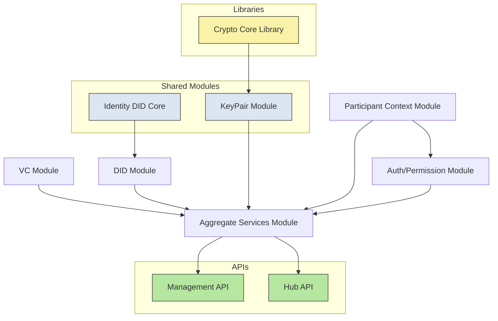
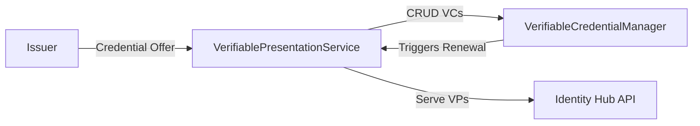
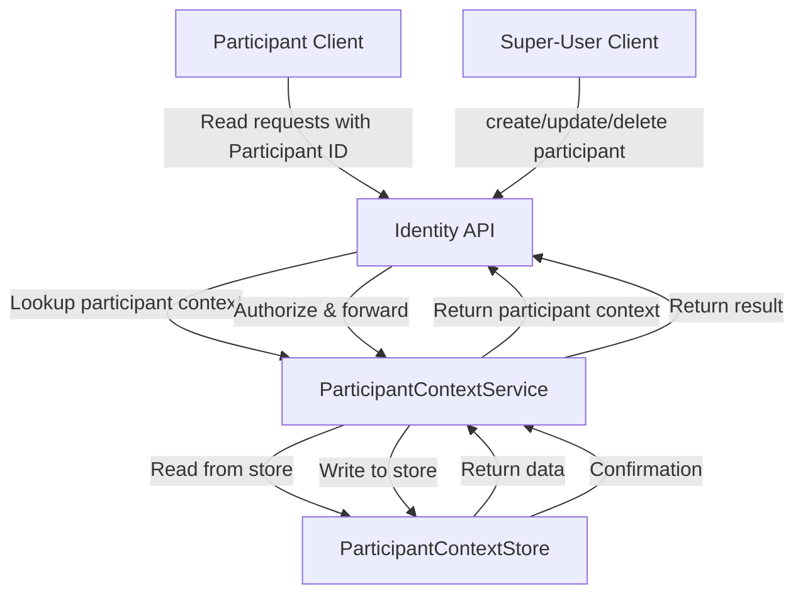
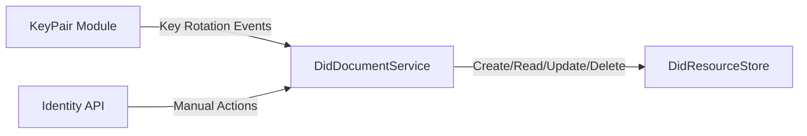
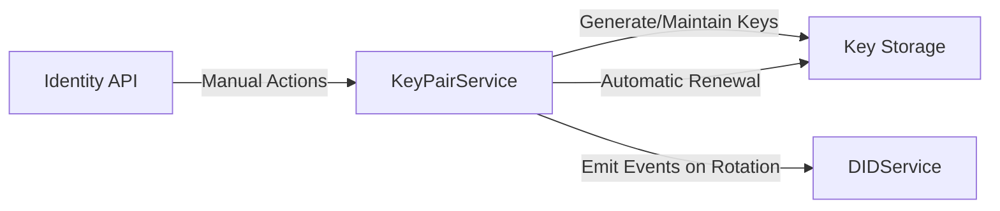
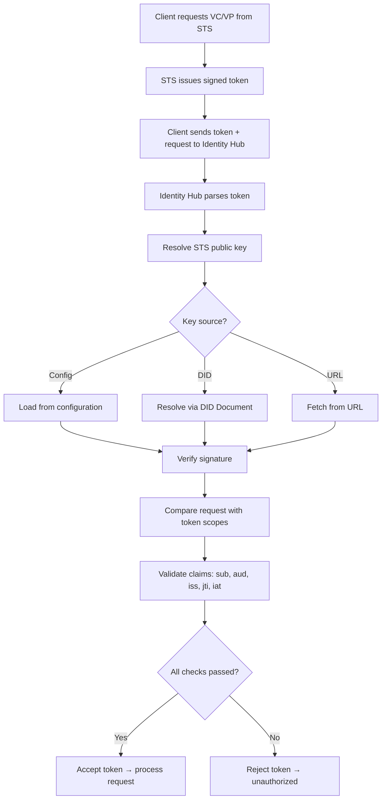

# Tractus-X Identity Hub Developer Guide

## Purpose
The Identity Hub (IH) is a core component in the Tractus-X dataspace architecture, responsible for managing decentralized identities and verifiable credentials for organizations. This document provides an overview of the IH architecture, key components, and main flows.

## Internal Services
- **Credential Service (CS)**: API to issue, store and present VCs/VPs. Ensures W3C VC formats and compatibility with DCP.
- **DID Service (DIDS)**: Management of key pairs, publication of DID Documents (e.g. `did:web`), key rotation and revocation.
- **Identity Service (IS)**: CRUD for organizational identities, mapping to DIDs, trust metadata.
- **Security Token Service (STS)**: Issues short-lived tokens for access to internal APIs (does not replace OIDC; oriented to M2M).

## Main Flows

1. **Credential Issuance**:
    - An external Issuer Service requests VC issuance from the Credential Service, authenticating via STS token.
    - The Credential Service validates the request, generates the VC, and stores it.
2. **Credential Presentation**:
    - A Connector requests a Verifiable Presentation (VP) from the Credential Service to prove certain attributes.
    - The Credential Service retrieves the relevant VCs, constructs the VP, and returns it.
3. **DID Management**:
    - The DID Service generates key pairs, creates and publishes DID Documents using `did:web`.
    - It handles key rotation and revocation as needed.
5. **Token Issuance**:
    - The STS issues short-lived access tokens to authenticated clients for accessing IH services.
    - Tokens are validated on each request to ensure secure access.

## Key Features
- W3C Verifiable Credentials and Presentations support.
- DCP protocol compliance for automated trust exchange.
- DID Document management with `did:web`.
- Secure token issuance for M2M authentication.
- Integration points for Issuer Services and external verifiers.
- Key lifecycle management (generation, rotation, revocation).
- Audit logging for credential operations.
---
## Modules and Services
The **Identity Hub** is composed of several modules and services that interact to manage decentralized identities, verifiable credentials, and associated operations. The diagram below illustrates the high-level architecture and relationships between these components.

---
### **Verifiable Credential Module**

**Responsibilities:**

- Generates and serves Verifiable Presentations (VPs) through the Hub API.
- CRUD operations for Verifiable Credentials (VCs), e.g., when the Issuer wants to write a VC via the Hub API or the Identity API.
- Runs the `VerifiableCredentialManager`.
- Exchanges protocol messages with the Issuer, e.g., in response to a credential-offer.

**VerifiableCredentialManager:**

- Can be configured for **auto-renewal** (default: true).
- Once renewal is triggered, the VC moves into the `REISSUE_REQUESTING` state.
- Renewal can be triggered by:
   1. An incoming credential offer.
   2. Nearing expiry (if auto-renewal is active).
   3. Manual action via the Identity API.
---
### Participant Context Module 
The Participant Context module manages the storage and lifecycle of participant contexts in the Identity Hub:

- It contains the ParticipantContextStore, which performs CRUD operations on participant entries.

- Mutating operations (create, update, delete) are only allowed by a super-user — typically a technical account used for onboarding or administrative tasks.

- Each participant context is uniquely identified by a **participant ID**.

- Clients must include their **participant ID** with every request to the Hub APIs so that the Identity Hub can locate the correct participant context.

---
### DID Module 

**Responsibilities:**

- Create, read, update, and optionally delete DID resources in the `DidResourceStore`.
- Publish/overwrite DID documents using the configured publishers.
- React to **key rotation events** from the KeyPair module (add new keys, remove old keys).
- Respond to manual actions via the Identity API.

---
### KeyPair Module 

**Responsibilities:**

- Generate and maintain key pairs using a state machine.
- Check for automatic renewal based on configured maximum key lifetimes.
- Emit events when a key is rotated.
- Respond to manual actions via the Identity API.

---
### Auth/Permissions Module 
When the Identity Hub (IH) receives a request containing a token issued by the Security Token Service (STS), it must parse and validate that token before processing the request.

Steps:

1. Parse the token

    - Extract the token from the request (e.g., a JWT).
    - Decode its structure to access the header, payload, and signature.

2. Verify the signature

    - Use the STS’s public key to verify that the token was signed by the STS’s private key.

    - The IH must be able to obtain the STS’s public key through one of several possible mechanisms:
       - A static configuration value
       - Resolution through a DID document 
       - Retrieval from a URL endpoint

    - This logic should be abstracted using a resolver component (e.g., PublicKeyResolver).

3. Validate the request against scopes

    - Compare the requested operation or resource with the scopes included in the token to ensure authorization.

3. Validate additional claims

    - Check standard JWT claims depending on the proof-of-possession model (sub, aud, iss, jti, iat...)

If all checks pass, the token is accepted and the request proceeds; otherwise, it’s rejected.

---
### Aggregate Services Module

The Aggregate Services Module is responsible for orchestrating complex operations that involve multiple lower-level services within the Identity Hub. Rather than having each client call several services individually, this module provides a single, cohesive interface to perform higher-level tasks.
#### **Key Responsibilities**

1. **Transaction Handling**
    - Ensures that multi-step operations across different services are executed reliably.
    - Supports **atomicity**, so that if one step fails, the module can roll back previous operations to maintain consistency.

2. **Service Orchestration**
    - Coordinates calls to various modules such as the **Participant Service**, **Credential Service**, and **Key Service**.
    - Combines results from these services to return a unified response to the client.

3. **Resource Management**
    - Maintains the state of resources across modules.
    - Handles event publishing to notify other parts of the system about changes in resources or contexts.

4. **Simplified Client Interaction**
    - Clients do not need to understand the internal dependencies between services.
    - Provides a higher-level API that abstracts the complexity of multiple underlying modules.
---
### SPI Module
The SPI Module (Service Provider Interface) provides extension points that allow the Identity Hub to interact with external systems or to swap implementations of internal functionality without modifying the core code. SPIs are abstractions

---
### Summary of principal API modules

| Module        | Responsibility                                        | Client Access                         |
|---------------|------------------------------------------------------|--------------------------------------|
| Hub API       | Presentation & Storage API, model classes, validators, JSON-LD transformers | Public clients (VC/VP operations)    |
| Identity API  | Key management, DID documents, credentials, participant context | Elevated clients for mutations; normal clients have limited read access |**

---
## NOTICE

This work is licensed under the [CC-BY-4.0](https://creativecommons.org/licenses/by/4.0/legalcode).

- SPDX-License-Identifier: CC-BY-4.0
- SPDX-FileCopyrightText: 2025 Contributors to the Eclipse Foundation
- Source URL: <https://github.com/eclipse-tractusx/tractusx-identityhub> 
