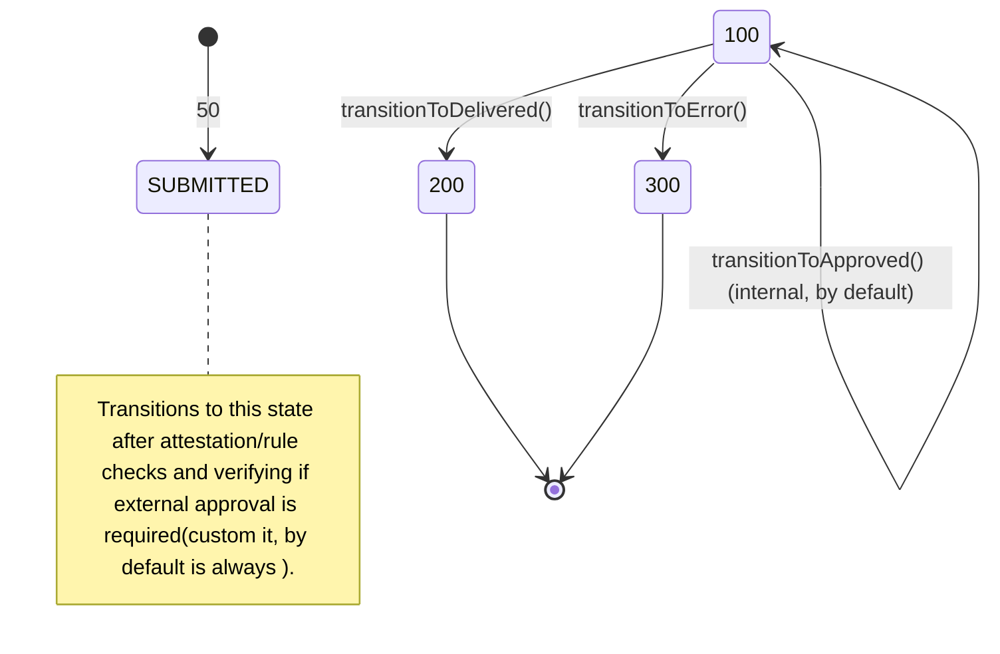

# Tractus-x IssuerService

## 1.Overview

The **IssuerService** is a core component of **IdentityHub** responsible for issuing **Verifiable Credentials (VCs)**.  
It handles:

- Validation of issuance requests.
- Application of issuer-defined policies.
- Generation of W3C-compliant credentials.
- Persistence of issuance records.

**Primary external actor:**

- `Client` → requests credential issuance via `IdentityHub`.

---

## 2.Core Modules of IssuerService

### 2.1 `issuerservice-core`

- Contains the **core logic** of the IssuerService.
- Responsible for:
  - Orchestrating the issuance workflow.
  - Applying **issuance rules** and policies.
  - Validating claims against credential definitions.
  - Constructing and signing Verifiable Credentials (VCs).

### 2.2 `issuerservice-credentials`

- Contains **domain models** and structures for credentials.
- Responsible for:
  - Defining credential schemas and data structures.
  - Supporting JSON-LD and W3C-compliant VC representations.
  - Utilities for credential transformation and serialization.

### 2.3 `issuerservice-holders`

- Handles interactions with **credential holders** (the entity receiving the VC).
- Responsible for:
  - Optional SPI to store or notify holders.
  - Interfacing with `HolderStore` implementations (SQL or other backends).
  - Managing holder-related metadata or attestations.

### 2.4 `issuerservice-issuance`

- Contains the **implementation of the issuance service**.
- Responsible for:
  - Integrating core logic, credential models, and holder interactions.
  - Recording issuance metadata in the **IssuanceProcessStore**.
  - Exposing SPI or API hooks for external IdentityHub components.
  - Ensuring auditability and traceability of issued credentials.

---

## 3.IssuerService SPIs

The IssuerService exposes several SPIs (Service Provider Interfaces) to allow for extensibility and customization:

### 3.1 `issuerservice-credential-spi`

Handles credential status management and operations:

- **CredentialStatusService**: Manages credential lifecycle operations like revocation, suspension, and status checking
- **IssuerCreentialOfferService**: Sends credential offers to holders proactively.

### 3.2 `issuerservice-issuance-spi`

Manages the credential issuance process lifecycle:

- **AttestationSource**: Sources data when an attestation pipeline is executed for credential issuance requests
- **AttestationContext**: Provides access to context data for attestation evaluation, including validated token claims and participant ID
- **CredentialGenerator**: Generates and signs credentials based on definitions and claims
- **CredentialGeneratorRegistry**: Registry for credential generators based on CredentialFormat
- **IssuanceProcess**: Tracks credential issuance processes through states ( SUBMITTED, APPROVED, DELIVERED,ERRORED). See diagram below.

### 3.3 `holder-spi`

Manages holder-related operations:

- **HolderService**: Manages holder information and operations within the issuer service context.

## Key Notes

1. IssuerService only persists metadata, not the full VC. Full VC storage happens in IdentityHub.

2. CredentialDefinitionStore provides schema, policies, and issuer DID.

3. IssuanceProcessStore logs issuance for auditing and potential revocation.

4. Issuerservice-issuance-rules module enforces policy/validation logic.

5. HolderStore can be SQL-backed or another SPI implementation for storing VCs.

> **Note:** The **IssuerAdminAPI** is optional. It is only needed when managing **credential definitions** or **issuer policies**.

---

## NOTICE

This work is licensed under the [CC-BY-4.0](https://creativecommons.org/licenses/by/4.0/legalcode).

- SPDX-License-Identifier: CC-BY-4.0
- SPDX-FileCopyrightText: 2025 Contributors to the Eclipse Foundation
- Source URL: <https://github.com/eclipse-tractusx/tractusx-identityhub>
