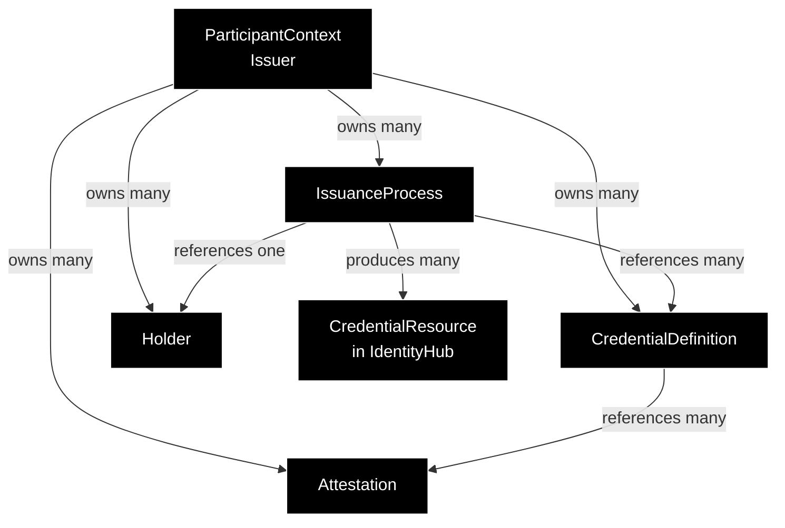
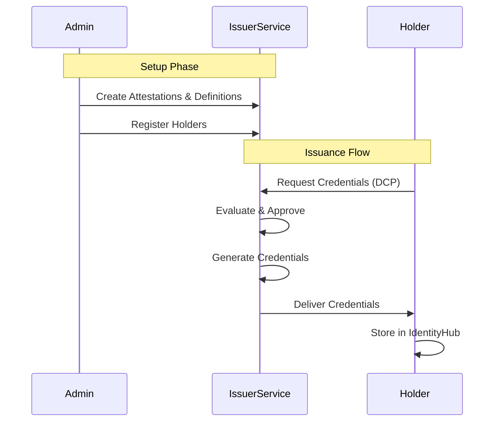

# IssuerService Developer Documentation

The **IssuerService** is responsible for issuing verifiable credentials to holders based on configured rules, attestations, and credential definitions. It implements the issuer role in the [Decentralized Claims Protocol (DCP) Issuance Flow](https://eclipse-dataspace-dcp.github.io/decentralized-claims-protocol/v1.0.1/#issuance-flow), handling credential requests from holders and delivering signed verifiable credentials.

This document describes the core data models that participate in the credential issuance flow.

## Table of Contents

1. [Core Models](#core-models)
    - [Attestation](#attestation)
    - [CredentialDefinition](#credentialdefinition)
    - [IssuanceProcess](#issuanceprocess)
    - [Holder](#holder)
2. [Credential Status and Revocation](#credential-status-and-revocation)
3. [Data Relationships](#data-relationships)
4. [Data Flow](#data-flow)
5. [Additional Information](#additional-information)

---

## Core Models

### Attestation

An **Attestation** defines how the IssuerService verifies claims before issuing credentials. Attestations represent evidence that must be evaluated before credential issuance can proceed.

**Purpose:**
Attestations validate claims about the holder before credentials are issued. For example:
- **Database attestation**: Verifies holder data exists in an onboarding database
- **Presentation attestation**: Requires holder to present existing credentials (holder attestation)
- **External attestation**: Calls external services to validate claims

**Lifecycle:**
1. Created via Admin API before credential definitions
2. Referenced by one or more CredentialDefinitions
3. Evaluated during credential request processing
4. Can be updated or deleted if not referenced by active credential definitions

### CredentialDefinition

A **CredentialDefinition** configures a specific type of credential that can be issued, including its schema, validity period, required attestations, issuance rules, and data mappings.

**Rules (CredentialRuleDefinition):**
Rules determine whether a credential should be issued based on attestation results:
```json
{
  "type": "expression",
  "configuration": {
    "claim": "onboarding.signedDocuments",
    "operator": "eq",
    "value": true
  }
}
```

**Mappings (MappingDefinition):**
Mappings transform attestation claims into credential subject fields:
```json
{
  "input": "participant.companyNumber",
  "output": "credentialSubject.companyNumber",
  "required": true
}
```

**Purpose:**
Credential definitions are templates that control:
- What credentials can be issued
- What evidence is required (attestations)
- What conditions must be met (rules)
- How data flows from attestations to credentials (mappings)

### IssuanceProcess

An **IssuanceProcess** tracks the asynchronous workflow of generating and delivering credentials to a holder. It is created when a holder requests credentials via the DCP Issuance Flow.

**Lifecycle States:**

| State | Code | Description | Operational Capabilities | Transitions |
| :--- | :--- | :--- | :--- | :--- |
| **SUBMITTED** | 50 | External approval required | Awaiting external approval signal | To APPROVED (after approval) or ERRORED (on rejection) |
| **APPROVED** | 100 | Ready for credential generation | - Generate credentials based on CredentialDefinitions<br/>- Map claims using MappingDefinitions<br/>- Add credentials to status lists<br/>- Deliver to holder's endpoint<br/>- Store in IdentityHub | To DELIVERED (on success) or ERRORED (after retry failures) |
| **DELIVERED** | 200 | Terminal success state | None (terminal state) | None |
| **ERRORED** | 300 | Terminal failure state | None (terminal state) | None |

- **SUBMITTED**: Default implementation auto-approves; custom implementations can enable manual approval workflows
- **APPROVED**: Will retry on transient failures up to configured limit (stateCount increments on retries)
- **ERRORED**: Contains `errorDetail` field with failure reason; requires manual investigation


**State Machine Flow:**
```
[CredentialRequest]
    ↓
APPROVED (if auto-approved) or SUBMITTED (if external approval required)
    ↓
APPROVED (after approval)
    ↓ (generate & deliver)
DELIVERED (success) or ERRORED (failure)
```

### Holder

A **Holder** represents an entity that can receive credentials from this issuer. Holders are registered with the IssuerService to enable credential offers and delivery.

**Purpose:**
- Maintains registry of known holders
- Stores holder's DID for credential subject
- Stores holder's endpoint information for credential delivery
- Links holders to specific issuer participant contexts

## Credential Status and Revocation

IssuerService provides credential status verification capabilities for revocation checking. When credentials are issued, they include a `credentialStatus` property that references a status list credential.

**Bitstring Status List Implementation:**
- IssuerService implements the **BitstringStatusList** specification for credential revocation
- Status list credentials are special verifiable credentials containing compressed bitstrings
- Each issued credential references a specific bit position in a status list credential
- Status lists are published to publicly accessible URLs for verification
- Supports revocation status checking

**Status List Credential Structure:**
```json
{
  "@context": ["https://www.w3.org/ns/credentials/v2"],
  "id": "https://issuer.example.com/credentials/status/3",
  "type": ["VerifiableCredential", "BitstringStatusListCredential"],
  "issuer": "did:example:issuer",
  "credentialSubject": {
    "id": "https://issuer.example.com/status/3#list",
    "type": "BitstringStatusList",
    "statusPurpose": "revocation",
    "encodedList": "uH4sIAAAAAAAA..."
  }
}
```

**Holder Credential Status Reference:**
Each issued credential contains a `credentialStatus` object:
```json
{
  "id": "https://issuer.example.com/credentials/status/3#94567",
  "type": "BitstringStatusListEntry",
  "statusPurpose": "revocation",
  "statusListIndex": "94567",
  "statusListCredential": "https://issuer.example.com/credentials/status/3"
}
```

**Key Features:**
- **Automatic Management**: Status list credentials created and managed automatically
- **Multiple Status Lists**: New status lists created automatically when current one is full
- **Public Resolution**: Status list credentials resolved via public endpoint

## Data Relationships



**Key Relationships:**
- Each **CredentialDefinition** references one or more **Attestation**
- Each **IssuanceProcess** references one **Holder** and one or more **CredentialDefinitions**
- An **IssuanceProcess** produces **CredentialResources** stored in the holder's IdentityHub
- All entities are owned by a **ParticipantContext** (the issuer)

## Data Flow



**Detailed Steps:**

1. **Issuer Setup**:
    - Administrator creates **Attestation** for claim validation
    - Administrator creates **CredentialDefinitions** referencing attestations
    - Administrator registers **Holders** that can receive credentials

2. **Credential Request (DCP Issuance Flow)**:
    - Holder sends CredentialRequestMessage to issuer's issuance endpoint
    - IssuerService evaluates attestations in AttestationPipeline
    - IssuerService evaluates rules against attestation results
    - If approved, **IssuanceProcess** created in APPROVED state with collected claims

3. **Asynchronous Generation (State Machine)**:
    - IssuanceProcessManager selects processes in APPROVED state
    - For each CredentialDefinition, credentials are generated:
        - Claims mapped to credential subject using MappingDefinitions
        - Credential signed with issuer's key pair
        - Credential added to StatusList (for revocation support)

4. **Credential Delivery**:
    - Credentials delivered to holder's CredentialService endpoint
    - On success: CredentialResources stored in holder's IdentityHub
    - IssuanceProcess transitions to DELIVERED

5. **Holder Receives Credentials**:
    - Holder stores CredentialResources
    - Credentials can be queried, presented, or revoked
    - Holder can use credentials in DCP Presentation Flow

6. **Credential Offers (Alternative Flow)**:
    - Issuer can proactively send CredentialOfferMessage to holder
    - Holder decides whether to accept and request credentials
    - If accepted, follows standard Credential Request flow

---

## Additional Information

- **Decentralized Claims Protocol (DCP)**: [DCP Specification v1.0.1](https://eclipse-dataspace-dcp.github.io/decentralized-claims-protocol/v1.0.1/)
- **Adopter Documentation**: [IssuerService Overview](https://eclipse-edc.github.io/documentation/for-adopters/issuer-service/)
- **Architecture Documentation**: [IssuerService Issuance Process](https://github.com/eclipse-edc/IdentityHub/blob/main/docs/developer/architecture/issuer/issuance/issuance.process.md)
- **API Documentation**:
    - [Issuance API](https://github.com/eclipse-edc/IdentityHub/tree/main/extensions/api/issuance-api) - DCP credential request endpoint
    - [Issuer Admin API](https://github.com/eclipse-edc/IdentityHub/tree/main/extensions/api/issuer-admin-api) - Manage attestations, definitions, holders, processes
- **GitHub Repository**: [eclipse-edc/IdentityHub](https://github.com/eclipse-edc/IdentityHub/)
  
---

## NOTICE

This work is licensed under the [CC-BY-4.0](https://creativecommons.org/licenses/by/4.0/legalcode).

* SPDX-License-Identifier: CC-BY-4.0
* SPDX-FileCopyrightText: 2026 LKS Next
* SPDX-FileCopyrightText: 2026 Contributors to the Eclipse Foundation
* Source URL: <https://github.com/eclipse-tractusx/tractus-x-identityhub>
