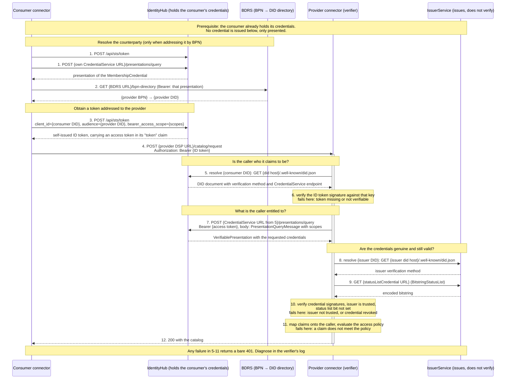

# DCP Presentation Flow: Connector-to-Connector Authentication

## Introduction

The [DCP API Walkthrough](../dcp-api-walkthrough/README.md) ends with a participant holding its credentials. This page
covers what happens next: how two connectors authenticate each other with those credentials, before any Dataspace
Protocol (DSP) message is answered.

This is the **presentation flow** of the
[DCP Specification v1.0.1](https://eclipse-dataspace-dcp.github.io/decentralized-claims-protocol/v1.0.1/), as it plays
out between two connectors, an IdentityHub and an IssuerService. The worked example is a catalog request, the shortest
exchange that triggers the whole handshake.

By the end of this page you will know:

- which service is called in which order, and with which token
- what the IdentityHub contributes at request time, as opposed to at issuance time
- where each kind of failure surfaces, which matters because a failed handshake returns a bare `401`

The runnable version of this flow is the Bruno collection at
[`docs/api/bruno/Identity Hub e2e`](../../api/bruno). `01 Setup Identities` prepares the two participants and the
issuer, and `02 Data Exchange` performs the catalog request, negotiation and transfer.

## Architecture

| Component | Role in this flow |
|-----------|-------------------|
| **Consumer connector** | Sends the request. It holds no credential itself, so it asks its IdentityHub to act for it |
| **IdentityHub** | The consumer's wallet: mints tokens (STS), publishes the DID document, answers the presentation query |
| **BDRS** | Resolves a Business Partner Number to a DID. Part of the Tractus-X connector stack, not of this repository. Only needed when the counterparty is addressed by BPN |
| **Provider connector** | The verifier. Every check happens here |
| **IssuerService** | Issued the credentials earlier. At request time it only publishes its DID document and its status list. It verifies nothing |

A single IdentityHub may hold the participant contexts of several participants, or each participant may run its own
instance. The flow is identical either way, because the verifier learns the address of the consumer's credential
service from the consumer's DID document, never from its own configuration.



## The steps

Endpoints are relative to the service endpoints listed in the
[DCP API Walkthrough](../dcp-api-walkthrough/README.md#service-endpoints).

| Step | Caller → Callee | Endpoint | Purpose |
|------|-----------------|----------|---------|
| 1 | Consumer → its IdentityHub | `POST /api/sts/token`, then `POST /api/credentials/v1/participants/{id}/presentations/query` | Obtain a presentation of the consumer's own `MembershipCredential`, which BDRS requires |
| 2 | Consumer → BDRS | `GET {BDRS URL}/bpn-directory` | Resolve the counterparty's BPN to its DID. Skipped when the request already names a DID |
| 3 | Consumer → its IdentityHub | `POST /api/sts/token` | Mint the self-issued ID token addressed to the provider |
| 4 | Consumer → Provider | the provider's DSP endpoint | The DSP request, carrying the ID token as bearer |
| 5 | Provider → consumer's IdentityHub | `GET {did host}/.well-known/did.json` | Resolve the consumer's DID: its verification method, and the `CredentialService` endpoint used in step 7 |
| 6 | Provider, internally | - | Verify the ID token signature. This proves who is calling, not what they may do |
| 7 | Provider → consumer's IdentityHub | `POST /api/credentials/v1/participants/{id}/presentations/query` | Collect the credentials, authorised by the access token from step 3 |
| 8 | Provider → IssuerService | `GET {issuer did host}/.well-known/did.json` | Resolve the issuer's verification method, to check the credential signatures |
| 9 | Provider → IssuerService | `GET {statusListCredential URL}` | Read the revocation bit of each credential |
| 10 | Provider, internally | - | Verify signatures, that the issuer is trusted, and that no status list bit is set |
| 11 | Provider, internally | - | Map the verified claims onto the caller and evaluate the access policy |
| 12 | Provider → Consumer | - | The catalog |

### Step 3 in detail

The Secure Token Service mints the token with `client_credentials`:

```http
POST /api/sts/token
Content-Type: application/x-www-form-urlencoded

grant_type=client_credentials
&client_id={consumer participant id}
&client_secret={STS client secret}
&audience={provider DID}
&bearer_access_scope=org.eclipse.tractusx.vc.type:MembershipCredential:read
```

The `access_token` of the response is the **self-issued ID token**. Its payload carries a `token` claim, and that inner
value is the **access token** the verifier presents in step 7.

### Step 7 in detail

```http
POST /api/credentials/v1/participants/{participantContextId}/presentations/query
Authorization: Bearer {access token from the "token" claim}
Content-Type: application/json

{
  "@context": [ "https://w3id.org/dspace-dcp/v1.0/dcp.jsonld" ],
  "type": "PresentationQueryMessage",
  "presentationDefinition": null,
  "scope": [ "org.eclipse.tractusx.vc.type:MembershipCredential:read" ]
}
```

The consumer never hands over its credentials. It authorises the verifier to fetch them, and what comes back is a
presentation signed for this one request.

> **Two tokens, easily confused.** The **ID token** says who is calling and is verified in steps 5-6. The **access
> token**, carried inside it, is not for the verifier to read: the verifier hands it back to the consumer's own
> IdentityHub in step 7. It grants permission to read the named credential types, and never contains the credentials.

## Where each failure surfaces

A failed handshake returns `401` without a `WWW-Authenticate` header and without detail, so the cause has to be read
from the verifier's log.

| Cause | Fails at step |
|-------|---------------|
| Wrong STS client secret | 3 (no token is minted, nothing leaves the consumer) |
| Token absent, or its signature does not verify | 5-6 |
| Credential revoked | 9-10 |
| Issuer not trusted by the verifier | 10 |
| A claim does not satisfy the policy | 11 |

A revoked or missing credential only breaks a request that actually asks for that credential: which credential types
are requested depends on the policy in scope and on the DSP version in use.

## Related

- [DCP API Walkthrough](../dcp-api-walkthrough/README.md): how the credentials are issued in the first place
- [Verify the Credential (step 10)](../dcp-api-walkthrough/10_verify_credential.md): the checks of step 10 performed by hand
- [Runtime View](../../architecture/4-runtime-view.md): onboarding, issuance and usage phases at the IdentityHub level
- [DCP Specification v1.0.1](https://eclipse-dataspace-dcp.github.io/decentralized-claims-protocol/v1.0.1/): the normative presentation flow

## NOTICE

This work is licensed under the [CC-BY-4.0](https://creativecommons.org/licenses/by/4.0/legalcode).

- SPDX-License-Identifier: CC-BY-4.0
- SPDX-FileCopyrightText: 2026 Contributors to the Eclipse Foundation
- Source URL: <https://github.com/eclipse-tractusx/tractusx-identityhub/blob/main/docs/usage/dcp-presentation-flow/README.md>
